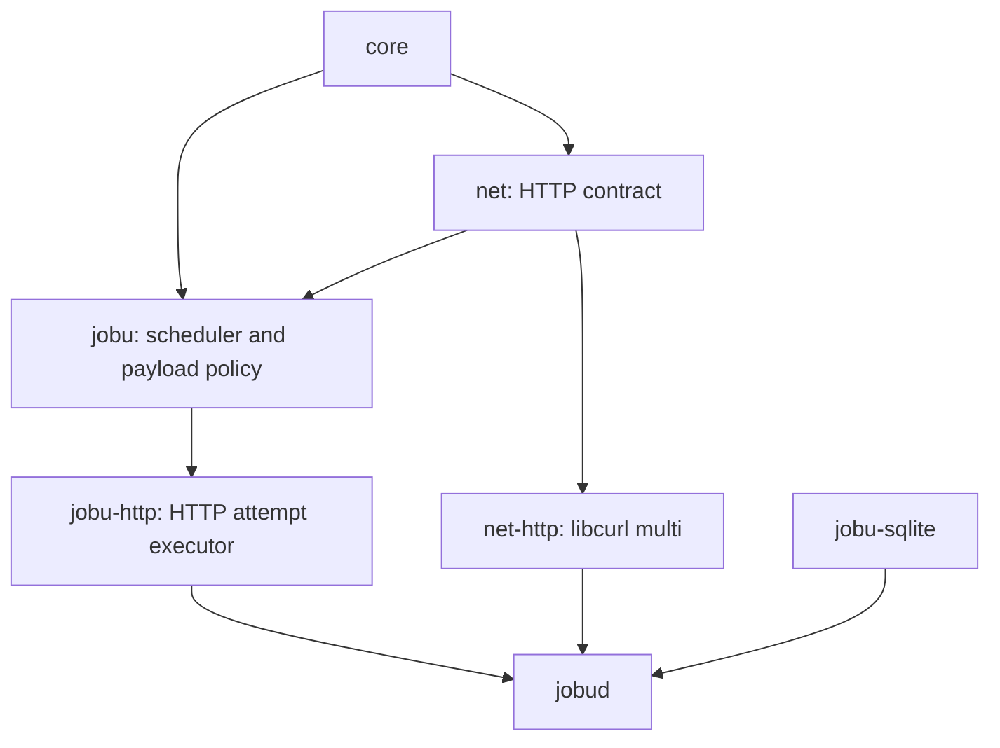
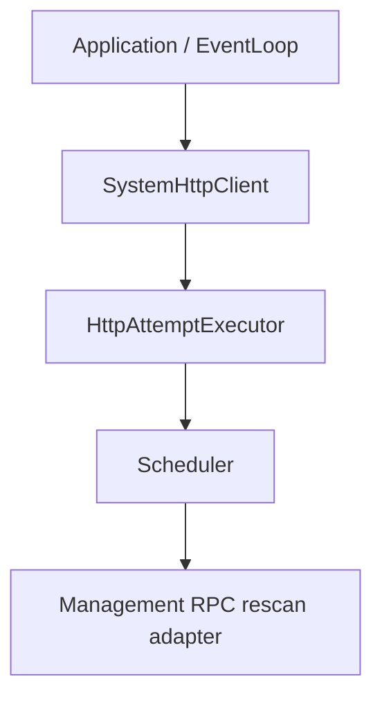

# JobU Phase 5 Code-Level Design

Status: implementation-ready design  
Baseline: `main` at `2cdc64dae62b0cf64bbaf6ed2b36c72f92fd5412`  
Prepared: 2026-08-27

## 1. Purpose

Phase 5 adds the first real JobU runner: asynchronous HTTP execution. It introduces a project-owned HTTP client API in `jb::net`, implements that API with a private libcurl multi backend integrated into the existing owner-thread `EventLoop`, adapts HTTP transfers to the existing `AttemptExecutor` contract, persists bounded response output in the existing attempt-output schema, and composes the real scheduler into `jobud`.

The exit condition is concrete: multiple HTTP jobs can execute concurrently through the real `Scheduler` without a blocking thread per job, while every external request begins only after the attempt's durable running transition commits.

Phase 5 is deliberately limited to HTTP. It does not implement native processes, CLI attempts, startup recovery, complete public run-control RPC, or coordinated fatal daemon shutdown.

## 2. Baseline and repository evidence

This design is based on GitHub `main` at commit `2cdc64d`, after Phase 4.1:

- Phase 4's deterministic scheduler, retries, capacity accounting, Run Now barriers, and cancellation state transitions are present.
- Phase 4.1 moved the generic JSON facility to `jb::core`; all new JSON code uses `jb::core::JsonValue` and `core.json.*` codec errors.
- `AttemptExecutor` already defines the durable-before-start and exactly-once asynchronous completion boundary.
- `Scheduler` already owns HTTP and CLI concurrency limits independently and fails closed on repository or executor protocol errors.
- `EventLoop` already provides owner-thread file-descriptor watches, one-shot timers, and posted tasks suitable for the libcurl multi socket API.
- `jobud` currently constructs management/RPC services but does not construct an executor or scheduler.
- `JobType::Http` and a minimal HTTP payload check already exist.
- Schema version 1 already contains attempts and `jobu_attempt_output`, with two BLOB channels and truncation/capture-loss flags.
- Materialized attribute decoding already re-applies built-in defaults, so adding standard attributes does not invalidate older persisted snapshots.
- The generic `jobu` target exposes no libcurl type or dependency.

The current main revision is the source of truth. If an implementation stage finds a material mismatch, stop that stage, document the evidence, and revise this design before changing the architecture.

## 3. Scope

### 3.1 In scope

- A project-owned asynchronous HTTP request/response/error/client contract in `jb::net`.
- A separate `net-http` target containing the private libcurl implementation.
- libcurl multi socket/timer integration with `jb::core::EventLoop`.
- Runtime verification of HTTP, HTTPS, TLS, gzip/deflate decoding, and asynchronous DNS support.
- HTTP/HTTPS only, explicit proxy policy, automatic decompression, TLS verification, manual redirects, and cross-origin header stripping.
- Bounded first/last response-body and raw-header capture.
- A complete v1 HTTP job payload decoder and validator shared by management and execution.
- Standard HTTP attributes for TLS, redirects, idempotency, retry classification, and output limits.
- A separate `jobu-http` target implementing `HttpAttemptExecutor` behind `AttemptExecutor`.
- Safe result JSON, retry classification, and `Retry-After` handling.
- Atomic persistence of attempt result, output, run/retry transition, recurrence, and capacity effects.
- Scheduler rescan notifications after successful management mutations.
- `jobud` composition of the HTTP client, HTTP executor, scheduler, RPC service, and local listener.
- Deterministic unit tests with fakes and bounded loopback integration tests with no external network dependency.
- Linux implementation and verification first; optional macOS verification only after Linux is complete.
- Useful Doxygen on every new or changed public declaration and implementation comments around non-obvious callback, security, capture, and transaction ordering.

### 3.2 Explicitly out of scope

- CLI/process execution, environment construction, pipes, signals, or process groups (Phase 6).
- Startup recovery of durable running attempts (Phase 7).
- Coordinated fatal daemon shutdown or graceful active-transfer draining (Phase 7).
- Public Run Now/cancel/history/output RPC and `jobuctl` commands beyond the already implemented management surface.
- Secrets, header secret references, encrypted secret resolution, or log redaction of arbitrary future secret objects (Phase 8).
- An HTTP server, general URL builder, cookie jar, cache, WebSocket, HTTP/3 policy, multipart/form builders, or JSON/form request builders.
- Environment-controlled proxies, `.netrc`, ambient credentials, or automatic authentication.
- Per-job proxy credentials or client TLS certificates.
- A libcurl-free HTTP backend.
- A database schema/version change.
- A second scheduler thread or a thread per transfer. libcurl's own asynchronous resolver may use internal resolver threads.
- Retrofitting a new `JB_BUILD_HTTP_DRIVER` option. libcurl becomes a required Phase 5 dependency.

Phase 5 request headers are literal job-document values. Current management reads can return those values, so this phase must not describe literal headers as protected secret storage. Secret references and protected secret resolution remain Phase 8 work.

## 4. Non-negotiable decisions

| Decision | Required result |
|---|---|
| Public ownership | HTTP values and `HttpClient` live in `jb::net`; no curl type appears publicly. |
| Backend isolation | `net-http` privately links `CURL::libcurl`; `net`, `jobu`, and their public headers do not. |
| Runner isolation | `jobu-http` implements HTTP attempts against the generic `HttpClient` and links only `jobu`; generic scheduler/runner code does not include a system HTTP header. |
| Threading | The client, executor, scheduler, database, and daemon RPC adapter run on one owner event-loop thread. |
| Nonblocking transfers | All active transfers share one libcurl multi handle driven by EventLoop FD watches and one libcurl timer. |
| Durable ordering | Scheduler commits the running attempt before `HttpAttemptExecutor::start()` can create network effects. |
| Completion | Every accepted HTTP start produces exactly one later completion; rejected starts produce none. |
| Engine failure | A fatal multi/EventLoop adapter error makes the client unavailable, terminates active requests safely, emits `failed` once, and accepts no new work. |
| DNS | Runtime libcurl must advertise asynchronous DNS; otherwise client creation fails. |
| Compression | Runtime libcurl must provide zlib decoding so gzip and deflate are consistently supported. |
| Protocols | Only `http` and `https` are accepted and configured at both validation and libcurl boundaries. |
| Redirects | Redirects are off by default and are followed manually, never by `CURLOPT_FOLLOWLOCATION`. |
| TLS | Certificate and hostname verification are enabled by default. Unsafe disable is explicit per job and prominently logged without URL/header/body data. |
| Proxy | Only an explicit daemon proxy is used. Omission explicitly disables all proxy environment variables. |
| Capture | Limits apply to decompressed body bytes and raw final-response header bytes. Transfers continue draining after limits. |
| Persistence | Output is committed in the same transaction as attempt/run completion. Failure rolls the transaction back and fails the scheduler. |
| Schema | Existing output columns are reused; schema version remains 1. |
| Compatibility | Existing materialized 11-attribute snapshots acquire new built-in defaults during decode. |
| Result safety | Completion result is a bounded object and contains no URL, query string, request/response body, header value, proxy, or raw curl diagnostic. |
| Documentation | Every public declaration added or changed in a stage has useful Doxygen and a first-include boundary test in that stage. |
| `[[nodiscard]]` | Apply it to fallible operations and value-returning queries that callers must handle, not routine cleanup or signal-like calls. |

## 5. Architecture and dependencies



Runtime ownership is:



The arrows in the runtime diagram mean “must outlive.” Construction therefore proceeds from top to bottom and destruction from bottom to top.

The scheduler continues to see one `AttemptExecutor`. In Phase 5 that executor supports `JobType::Http` and reports `false` for `JobType::Cli`; CLI runs remain pending without consuming capacity or becoming failed attempts.

## 6. Target and source layout

### 6.1 Generic `net` additions

Add to `src/net/CMakeLists.txt`:

```text
src/net/http_client.hpp       public
src/net/http_client.cpp       private implementation of base lifecycle/validation helpers
src/net/http_validation_priv.hpp/.cpp  generic method/URL/header validation
src/net/http_capture_priv.hpp/.cpp     bounded first/last capture
```

`net` continues to link only project targets such as `core`. It does not call `find_package(CURL)`.

### 6.2 New `net-http` target

Add:

```text
src/net/http/CMakeLists.txt
src/net/http/system_http_client.hpp       public
src/net/http/system_http_client.cpp       private pimpl and public factory
src/net/http/curl_runtime_priv.hpp/.cpp   global initialization and runtime feature checks
src/net/http/curl_multi_priv.hpp/.cpp     multi socket/timer adapter
src/net/http/curl_request_priv.hpp/.cpp   one request/redirect-chain state
src/net/http/http_url_priv.hpp/.cpp       private curl URL/origin helpers
```

The target:

```cmake
find_package(CURL 7.85 REQUIRED)

add_library(net-http STATIC)
target_link_libraries(net-http
    PUBLIC net
    PRIVATE CURL::libcurl
)
```

curl 7.85 is the minimum because `CURLOPT_PROTOCOLS_STR` was introduced there. No curl include directory is propagated through a public header.

### 6.3 Generic `jobu` additions

Add private HTTP policy files to `jobu`:

```text
src/jobu/http_job_payload_priv.hpp/.cpp
src/jobu/http_retry_priv.hpp/.cpp
```

Update:

```text
src/jobu/job_validation_priv.*
src/jobu/attribute_registry.*
src/jobu/attempt_executor.hpp
src/jobu/scheduler_core_priv.cpp
src/jobu/scheduler_repository_priv.*
src/jobu/management_rpc.*
```

Payload parsing and status-selector policy belong to generic JobU because management must reject invalid HTTP definitions before any libcurl backend is constructed.

### 6.4 New `jobu-http` target

Add:

```text
src/jobu/http/CMakeLists.txt
src/jobu/http/http_attempt_executor.hpp       public
src/jobu/http/http_attempt_executor.cpp       private pimpl
src/jobu/http/http_completion_priv.hpp/.cpp   mapping and bounded result creation
```

The target links `jobu` only. It depends on the abstract project-owned `HttpClient`, not `SystemHttpClient`; its public header includes only project-owned headers. This allows the complete runner policy to be tested with `FakeHttpClient` and prevents a transitive curl dependency.

### 6.5 Daemon and tests

Update `src/jobud/CMakeLists.txt` to link `jobu-sqlite`, `jobu-http`, and `net-http`.

Add focused tests and support under `test/`:

```text
test/http-client-contract-test.cpp
test/http-capture-buffer-test.cpp
test/system-http-client-test.cpp
test/http-job-payload-test.cpp
test/http-retry-test.cpp
test/http-attempt-executor-test.cpp
test/http-scheduler-integration-test.cpp
test/jobud-http-integration-test.cpp
test/net-http-public-header-test.cpp
test/jobu-http-public-header-test.cpp
test/support/fake_http_client.hpp/.cpp
test/support/http_test_server.hpp/.cpp
test/support/http_test_certificates.hpp
```

OpenSSL is permitted only as a test dependency for the loopback TLS server. No production target links OpenSSL directly.

## 7. Public `jb::net` HTTP contract

### 7.1 `http_client.hpp`

The following is a declaration outline. Exact formatting may follow repository conventions, but names, ownership, fields, and semantics are fixed.

```cpp
/** @file http_client.hpp
 * @brief Defines the project-owned asynchronous HTTP client contract.
 */
#pragma once

#include "byte_buffer.hpp"
#include "error.hpp"
#include "object.hpp"
#include "result.hpp"
#include "signal.hpp"
#include "time_source.hpp"

namespace jb::net {

using HttpRequestId = std::uint64_t;

struct HttpHeader {
    std::string name;
    std::string value;
    bool sensitive{false};
};

struct HttpCapturedData {
    jb::core::ByteBuffer bytes;
    std::uint64_t total_bytes{0};
    bool truncated{false};
};

struct HttpRequest {
    std::string method{"GET"};
    std::string url;
    std::vector<HttpHeader> headers;
    std::optional<jb::core::ByteBuffer> body;
    jb::core::Duration timeout{std::chrono::seconds{120}};
    bool verify_tls{true};
    bool follow_redirects{false};
    std::uint32_t max_redirects{5};
    std::size_t response_body_limit{1024U * 1024U};
    std::size_t response_header_limit{64U * 1024U};
};

struct HttpResponse {
    std::uint16_t status_code{0};
    std::vector<HttpHeader> headers;
    HttpCapturedData body;
    HttpCapturedData raw_headers;
    std::uint32_t redirect_count{0};
    jb::core::Duration elapsed{};
    std::optional<bool> tls_verified;
};

enum class HttpErrorKind : std::uint8_t {
    InvalidRequest,
    Resolve,
    Connect,
    TlsVerification,
    TlsHandshake,
    Timeout,
    Send,
    Receive,
    Redirect,
    Protocol,
    Cancelled,
    Internal,
};

struct HttpError {
    HttpErrorKind kind{HttpErrorKind::Internal};
    jb::core::Error error;
    std::optional<std::uint16_t> status_code;
    std::vector<HttpHeader> headers;
    HttpCapturedData body;
    HttpCapturedData raw_headers;
    std::uint32_t redirect_count{0};
    jb::core::Duration elapsed{};
    std::optional<bool> tls_verified;
};

using HttpCompletionResult = jb::core::Result<HttpResponse, HttpError>;
using HttpCompletionHandler = std::function<void(HttpRequestId, HttpCompletionResult)>;

class HttpClient : public jb::core::Object {
public:
    explicit HttpClient(jb::core::Object* parent = nullptr);
    ~HttpClient() override;

    HttpClient(HttpClient const&) = delete;
    HttpClient(HttpClient&&) = delete;
    auto operator=(HttpClient const&) -> HttpClient& = delete;
    auto operator=(HttpClient&&) -> HttpClient& = delete;

    [[nodiscard]] virtual auto is_available() const noexcept -> bool = 0;
    [[nodiscard]] virtual auto start(HttpRequest request, HttpCompletionHandler completion)
        -> jb::core::Result<HttpRequestId, jb::core::Error> = 0;
    [[nodiscard]] virtual auto cancel(HttpRequestId request_id)
        -> jb::core::Result<void, jb::core::Error> = 0;
    [[nodiscard]] virtual auto active_request_count() const noexcept -> std::size_t = 0;
    [[nodiscard]] virtual auto failure() const -> std::optional<jb::core::Error> = 0;

    jb::core::Signal<jb::core::Error> failed;
};

} // namespace jb::net
```

Every type, field, enum value, method, ownership rule, limit, callback rule, error behavior, and threading constraint must have useful Doxygen in the actual header. The outline omits those comments only to keep this design readable.

### 7.2 Ownership and callback rules

- `HttpRequest`, response, error, captures, headers, and the callback are owning values.
- The client allocates positive monotonically increasing request identifiers. Exhaustion rejects a start rather than wrapping.
- `start()` validates and takes ownership. On success it invokes the handler exactly once later on the client owner thread.
- A handler must never run inside `start()`, even if validation and a loopback transfer can finish immediately.
- A failed `start()` retains no handler and creates no callback obligation.
- `cancel()` accepts cancellation but does not invoke the handler inside `cancel()`. The original handler later receives `HttpErrorKind::Cancelled` exactly once.
- Unknown or already completed identifiers return `net.http.request_not_found`.
- Destruction removes all curl handles and EventLoop resources and suppresses retained callbacks; production ownership must nevertheless destroy the scheduler before the executor and client.
- Handler invocation removes active state first so handlers may start/cancel other requests without invalidating iteration.
- All calls except signal subscription occur on the client's EventLoop owner thread.

### 7.3 Generic validation

`HttpClient::start()` or a shared generic helper validates before backend admission:

- method is a nonempty RFC HTTP token and at most 32 bytes;
- URL is final-wire-form printable ASCII, at most 16 KiB, has an `http` or `https` scheme and host, uses valid percent escapes, and contains no whitespace, control, NUL, userinfo, or fragment;
- at most 128 request headers;
- header names are nonempty HTTP tokens;
- header values contain no CR, LF, or NUL;
- case-insensitive duplicate request header names are rejected;
- total request header name/value bytes are at most 64 KiB;
- a HEAD request cannot carry a body;
- timeout is from 1 millisecond through 30 days;
- redirect maximum is at most 20 and must be at least 1 when following is enabled;
- body and response limits are representable by backend size types;
- body absence remains distinct from an explicitly present empty body.

JobU performs stricter reserved-header checks at job-definition time. The generic client still rejects protocol-dangerous headers (`Host`, `Content-Length`, `Transfer-Encoding`, `Connection`, `Proxy-Connection`, `TE`, `Trailer`, and `Upgrade`) so other future callers cannot bypass framing ownership.

### 7.4 Stable generic errors

Public errors use safe `net.http.*` codes. At minimum:

| Code | Meaning |
|---|---|
| `net.http.invalid_request` | Generic request validation failed. |
| `net.http.unavailable` | Client is not accepting starts. |
| `net.http.identifier_exhausted` | No new nonzero request ID can be allocated. |
| `net.http.request_not_found` | Cancellation did not name an active request. |
| `net.http.resolve_failed` | Name resolution failed. |
| `net.http.connect_failed` | Connection or proxy connection failed. |
| `net.http.tls_verification_failed` | Certificate or hostname verification failed. |
| `net.http.tls_handshake_failed` | TLS setup failed for another reason. |
| `net.http.timeout` | Whole-request deadline expired. |
| `net.http.send_failed` | Request transmission failed. |
| `net.http.receive_failed` | Response transfer failed. |
| `net.http.redirect_failed` | Redirect policy, target, downgrade, or limit failed. |
| `net.http.protocol_error` | HTTP response/header protocol was unusable. |
| `net.http.cancelled` | Caller-requested cancellation was observed. |
| `net.http.internal` | Bounded internal request failure. |
| `net.http.backend_failed` | Shared multi/EventLoop adapter entered Failed. |

No error message or detail may contain the URL, query, proxy, request/response header value, body bytes, curl error buffer, or server-supplied text. Curl codes are mapped privately and may be logged only as numeric backend diagnostics alongside JobU identifiers, never alongside sensitive request material.

## 8. `SystemHttpClient` public contract

`src/net/http/system_http_client.hpp` contains:

```cpp
namespace jb::net::http {

struct SystemHttpClientOptions {
    std::optional<std::filesystem::path> ca_bundle;
    std::optional<std::string> proxy;
    std::size_t maximum_parsed_response_header_bytes{8U * 1024U * 1024U};
};

class SystemHttpClient final : public jb::net::HttpClient {
public:
    [[nodiscard]] static auto create(jb::core::EventLoop& loop,
                                     SystemHttpClientOptions options = {})
        -> jb::core::Result<std::unique_ptr<SystemHttpClient>, jb::core::Error>;

    ~SystemHttpClient() override;

    // HttpClient overrides.

private:
    struct Private;
    std::unique_ptr<Private> _data;
};

} // namespace jb::net::http
```

The real header fully documents:

- the borrowed EventLoop must outlive the client;
- creation and use occur on that EventLoop's owner thread;
- the returned `unique_ptr` is the sole owner; the factory does not also install an Object parent;
- the optional CA path is copied and must name a readable regular file;
- the optional proxy accepts only an absolute `http` or `https` URL without userinfo in Phase 5; an HTTPS proxy additionally requires the runtime HTTPS-proxy feature;
- absent proxy means explicit no-proxy behavior, not environment fallback;
- the parsed-header hard limit is inclusive, nonzero, and at most 64 MiB;
- factory failures create no partially usable object.

## 9. Private libcurl backend

### 9.1 Runtime initialization and feature gate

A private process-lifetime runtime guard calls `curl_global_init(CURL_GLOBAL_DEFAULT)` exactly once and calls `curl_global_cleanup()` at process teardown after all clients are gone. The factory then checks `curl_version_info(CURLVERSION_NOW)` for:

- runtime version at least 7.85.0;
- `http` and `https` protocols;
- SSL support;
- zlib support for guaranteed gzip/deflate response decoding;
- `CURL_VERSION_ASYNCHDNS`.

Missing features return `net.http.runtime_unavailable`. JobU must not silently accept a synchronous resolver because DNS would block the scheduler owner thread.

### 9.2 Multi/EventLoop integration

One `SystemHttpClient` owns one `CURLM` multi handle and any number of easy handles. It configures:

- `CURLMOPT_SOCKETFUNCTION` and `CURLMOPT_SOCKETDATA`;
- `CURLMOPT_TIMERFUNCTION` and `CURLMOPT_TIMERDATA`;
- one EventLoop watch per curl socket using Read/Write flags;
- one replaceable EventLoop timer for curl's current timeout;
- `curl_multi_socket_action()` for ready FDs and `CURL_SOCKET_TIMEOUT`;
- `curl_multi_info_read()` after every action to identify completed easy handles.

The adapter must account for callback reentrancy: socket and timer callbacks may add, change, or remove watches while `curl_multi_socket_action()` is active. It must defer destructive state erasure until the current drive stack can no longer reference that state.

Adding an easy handle schedules a zero-delay EventLoop drive rather than driving inline. This is the mechanism that enforces “no completion inside `start()`.”

An EventLoop watch/timer registration failure or non-OK multi code leaves curl transfer state uncertain. The client therefore:

1. stores the first safe `net.http.backend_failed` error;
2. disarms the timer and removes watches;
3. removes/cleans every easy handle;
4. schedules exactly one safe Internal completion for each accepted request;
5. changes `is_available()` to false; and
6. emits `failed` exactly once after state is updated.

It never attempts to continue the same multi handle after such a failure.

### 9.3 Easy-handle baseline

Each transfer leg sets, checks, and owns the data behind every pointer option. Required options include:

- `CURLOPT_NOSIGNAL = 1L`;
- `CURLOPT_PROTOCOLS_STR = "http,https"`;
- `CURLOPT_FOLLOWLOCATION = 0L`;
- `CURLOPT_ACCEPT_ENCODING = ""` for all compiled-in decompression;
- `CURLOPT_TIMEOUT_MS` to the remaining whole-request deadline;
- `CURLOPT_CONNECTTIMEOUT_MS` no greater than the remaining deadline;
- explicit method/body/header callbacks and data;
- write and header callbacks that never throw through C;
- `CURLOPT_PRIVATE` or an equivalent checked mapping to owned request state;
- `CURLOPT_PROXY` set to the explicit proxy or `""` when none is configured;
- `CURLOPT_NOPROXY = ""` so ambient `NO_PROXY` cannot override an explicit daemon proxy;
- `CURLOPT_SSL_VERIFYPEER = 1L` and `CURLOPT_SSL_VERIFYHOST = 2L` by default;
- `CURLOPT_CAINFO` only for an explicit CA bundle.

Do not enable libcurl cookies, `.netrc`, unrestricted authentication, environment proxy inheritance, or automatic redirects.

### 9.4 Request method, body, and headers

- HEAD uses `CURLOPT_NOBODY` and never sends a body.
- GET without a body uses ordinary GET behavior.
- POST, PUT, PATCH, DELETE, and valid extension methods use the exact requested method.
- An absent body and an explicitly empty body remain distinct.
- Body bytes stay owned until the easy handle is removed.
- libcurl owns transfer framing. Caller-supplied `Content-Length` and `Transfer-Encoding` are forbidden.
- Request header order follows the validated vector. Names preserve user spelling, while comparisons are ASCII case-insensitive.
- Automatic `Expect: 100-continue` is disabled by adding an empty `Expect:` header unless a future contract explicitly supports it.

### 9.5 Response parsing and decompression

The body callback receives decompressed bytes because `CURLOPT_ACCEPT_ENCODING` is enabled. The capture and `total_bytes` therefore measure the decompressed representation, not compressed wire size. gzip and deflate are guaranteed by the runtime feature gate; Brotli and zstd are accepted when the selected libcurl also provides them.

The header callback handles status lines, 1xx blocks, proxy CONNECT blocks, and a final response block without confusing their headers. Only the final non-informational response's parsed headers and raw header capture are returned. A new redirect leg resets final-response capture for that leg.

Parsing has a hard independent bound from `SystemHttpClientOptions`. Exceeding it returns `HttpErrorKind::Protocol`, even when the user-visible raw header capture limit is smaller or zero. Header names and values are trimmed only according to HTTP field syntax; raw capture preserves the selected final status line, header fields, line endings, and terminating empty line.

### 9.6 First/last capture algorithm

`CaptureBuffer(limit)` always counts all callback bytes, even after retention is full:

- limit `0`: retain nothing, count everything;
- total `<= limit`: retain all bytes and set `truncated=false`;
- total `> limit`: retain the first `(limit + 1) / 2` bytes and last `limit / 2` bytes and set `truncated=true`.

The suffix uses a bounded ring or equivalent bounded storage. Appending checks multiplication, addition, and `uint64_t` overflow before changing state. Capture never returns short consumption to libcurl merely because the retention limit was reached; the transfer keeps draining.

### 9.7 Timeout and cancellation

The request records one monotonic deadline at accepted start. Redirect legs receive only the remaining time; DNS, proxy connection, TCP connection, TLS, redirects, request transmission, decompression, and response draining all consume the same `job.timeout` budget.

Cancellation removes the easy handle and schedules a Cancelled completion after `cancel()` returns. If a transfer completed first, normal completion wins because active state is retired before user callbacks. A second cancellation receives `request_not_found` and never creates a second result.

### 9.8 Manual redirect policy

Manual redirects are mandatory because libcurl's automatic mechanism protects only a narrow set of credential headers and may forward other custom sensitive headers across hosts.

Only 301, 302, 303, 307, and 308 with one valid `Location` are redirect candidates. Rules:

| Status | Next method/body |
|---|---|
| 301/302 | POST becomes GET with no body; every other method/body is preserved. |
| 303 | HEAD remains HEAD; every other method becomes GET with no body. |
| 307/308 | Method and body are preserved exactly. |

For each candidate:

- resolve relative `Location` against the current URL with libcurl's private URL API or an equivalently checked parser, never string concatenation;
- re-run URL validation;
- reject non-HTTP(S), userinfo, control characters, and fragments;
- reject HTTPS-to-HTTP downgrade;
- enforce the request-wide redirect count;
- define origin as lower-case scheme, canonical host, and effective port;
- on a cross-origin hop permanently strip every header with `sensitive=true` and all `Authorization`, `Cookie`, and `Proxy-Authorization` headers regardless of the supplied flag;
- never restore stripped headers if a later hop returns to the original origin;
- preserve JobU metadata and optional `Idempotency-Key` because they are not authentication credentials;
- retain only the final leg's body/header output while reporting the total redirect count.

A disabled redirect policy returns the 3xx response normally for expected-status classification. An enabled policy with a missing/invalid location, downgrade, or exceeded limit returns `HttpErrorKind::Redirect`.

## 10. HTTP job payload

### 10.1 Canonical JSON shape

The HTTP job payload is:

```json
{
  "url": "https://example.test/hooks",
  "method": "POST",
  "headers": [
    {"name": "Content-Type", "value": "application/json"},
    {"name": "Authorization", "value": "Bearer literal", "sensitive": true}
  ],
  "body": {"encoding": "utf8", "data": "{\"ok\":true}"},
  "expected_statuses": ["200-299", "304"]
}
```

`url` is required. Defaults and optional members are:

| Member | Default |
|---|---|
| `method` | `GET` |
| `headers` | empty array |
| `body` | absent body |
| `expected_statuses` | `["200-299"]` |

Body encoding is `utf8` or strict RFC 4648 `base64`. `utf8` requires valid UTF-8 and copies its encoded bytes exactly; base64 accepts no whitespace or noncanonical alphabet/padding and decodes to arbitrary raw bytes. The existing 256 KiB serialized job-document limit remains the outer body/payload bound.

Unknown object members are preserved in the stored payload and ignored by this Phase 5 decoder for forward compatibility. Known members with wrong types or invalid values are rejected.

That additive rule applies to the top-level payload only. Header-entry and body objects are closed typed structures; unknown nested members are rejected so misspelled security/encoding fields cannot be silently ignored.

### 10.2 Payload validation

The shared private decoder validates:

- the generic method, URL, header-count, header-byte, and body rules in section 7.3;
- `headers` is an array of objects containing exactly string `name`, string `value`, and optional boolean `sensitive` among known fields;
- case-insensitive duplicate request header names are rejected;
- reserved framing headers from section 7.3 are rejected;
- every `X-JobU-*` header and `Idempotency-Key` is rejected because JobU owns them;
- `Authorization`, `Cookie`, and `Proxy-Authorization` are forced sensitive even if omitted or false;
- `body` has one supported encoding and one string data member;
- `expected_statuses` is a nonempty array with at most 64 selectors;
- each selector is exactly `NNN` or `NNN-NNN`, within 100 through 599, and not descending;
- selectors normalize to a bounded merged set for matching; overlap is accepted but has no duplicate effect.

Creation and update continue returning `jobu.job.invalid_payload`, with a stable safe reason in error detail. The decoder must not put URL, headers, or body into error data.

The executor decodes the immutable run snapshot again. Failure there means stored data is corrupt or incompatible and causes a failed start with `jobu.http.invalid_snapshot`; it does not attempt a network request.

## 11. Standard HTTP attributes

Expand `StandardAttributeRegistry` from 11 to 19 definitions. All new definitions use daemon-default, queue-default, and job scopes.

| Name | Type | Built-in default | Validation |
|---|---|---:|---|
| `http.follow_redirects` | Boolean | `false` | — |
| `http.idempotency_key` | Boolean | `false` | — |
| `http.max_redirects` | Integer | `5` | 0–20; at least 1 when following is true |
| `http.retry_errors` | List | listed below | unique supported strings only, at most 16 |
| `http.retry_statuses` | List | `408`, `429`, `500-599` | status selectors as in payload, at most 64 |
| `http.tls_verify` | Boolean | `true` | — |
| `output.http_body_limit` | Integer | `1048576` | 0–67108864 bytes |
| `output.http_headers_limit` | Integer | `65536` | 0–4194304 bytes |

The default `http.retry_errors` list is:

```text
resolve, connect, tls_handshake, timeout, send, receive
```

Allowed override categories are:

```text
resolve, connect, tls_handshake, tls_verification,
timeout, send, receive, redirect, protocol
```

`cancelled`, `invalid_request`, `internal`, and shared backend failure are never retry-configurable.

New cross-field validation enforces the redirect relationship and list uniqueness. Existing materialized documents are decoded through the already implemented re-materialization path, so they receive these eight built-in values without schema or document-version migration. Tests must cover decoding an exact old 11-definition snapshot under the 19-definition registry.

The existing attributes retain their meaning:

- `job.timeout` is the whole HTTP deadline;
- `output.capture` selects `none`, `on_error`, or `always`;
- generic retry policy still decides attempt count, delay, jitter, multiplier, maximum delay, and blocking/reschedule mode;
- `output.stdout_limit` and `output.stderr_limit` remain reserved for the future CLI runner.

Proxy and CA bundle are daemon startup options, not job attributes.

## 12. Retry and completion mapping

### 12.1 Status result

- A completed transfer whose status matches `expected_statuses` succeeds even if that status also appears in `http.retry_statuses`.
- An unexpected status produces `AttemptOutcome::Failed`.
- It is `Retryable` when the status matches `http.retry_statuses`; otherwise it is `Terminal`.
- The default therefore retries 408, 429, and 500–599 and treats other unexpected statuses, especially other 4xx, as terminal.

### 12.2 Transport result

Map `HttpErrorKind` to the canonical category string. The failure is Retryable only when that category occurs in `http.retry_errors`. Defaults make resolve/connect/TLS-handshake/timeout/send/receive retryable; TLS verification, redirect, and protocol failures are terminal unless explicitly selected.

Invalid configuration/snapshot, internal failure, and shared backend failure are always terminal. Cancellation produces `AttemptOutcome::Cancelled` with no failure disposition or retry deadline.

### 12.3 `Retry-After`

Only a retryable unexpected 429 or 503 may supply an executor retry lower bound. Parse one final-response `Retry-After` value as:

- nonnegative decimal delay-seconds relative to completion time; or
- IMF-fixdate HTTP-date.

Multiple values, obsolete date formats, invalid syntax, overflow, or a date not later than completion time are ignored safely. The candidate is clamped to `completed_at + retry.max_delay` and stored as `retry_not_before`. The scheduler already chooses the later of its computed retry delay and the executor lower bound.

The result JSON records whether the server value was accepted and whether it was clamped, without recording the raw header.

### 12.4 Safe result object

The HTTP executor produces a deterministic object below the existing 256 KiB limit. Shape:

```json
{
  "type": "http",
  "status": 503,
  "outcome": "unexpected_status",
  "error_category": "receive",
  "error_code": "net.http.receive_failed",
  "redirects": 1,
  "duration_ms": 125,
  "tls_verified": true,
  "body": {"captured_bytes": 1048576, "total_bytes": 2000000, "truncated": true},
  "headers": {"captured_bytes": 4096, "total_bytes": 4096, "truncated": false},
  "retry_after": {"accepted": true, "clamped": false}
}
```

Only applicable fields are emitted. `error_category` and `error_code` appear for transport/policy errors, not ordinary unexpected status. `status` appears only when a final status was observed. No captured bytes are embedded in result JSON.

## 13. Attempt output contract and persistence

### 13.1 Public executor completion extension

Extend `attempt_executor.hpp` with fully documented owning types:

```cpp
struct AttemptOutputChannel {
    jb::core::ByteBuffer bytes;
    std::uint64_t total_bytes{0};
    bool truncated{false};
};

struct AttemptOutput {
    std::optional<AttemptOutputChannel> primary;
    std::optional<AttemptOutputChannel> diagnostic;
    bool capture_lost{false};
};

struct AttemptCompletion {
    // Existing fields.
    std::optional<AttemptOutput> output;
};
```

Names are runner-neutral:

| Channel | HTTP Phase 5 | CLI Phase 6 |
|---|---|---|
| `primary` | decompressed final response body | stdout |
| `diagnostic` | raw final response headers | stderr |

An absent channel means no bytes/metadata were available for that channel; a present channel with an empty buffer and zero total means capture observed an empty stream. This preserves the existing schema's NULL-versus-empty distinction.

Completion validation requires:

- `total_bytes >= bytes.size()`;
- `truncated == (total_bytes > bytes.size())`;
- retained primary at most 64 MiB;
- retained diagnostic at most 4 MiB in Phase 5 and never beyond the general 64 MiB structural guard;
- no output when capture mode says none;
- output is optional, so success under `on_error` stores none.

Update `FakeAttemptExecutor` and public-header tests in the same stage.

### 13.2 Existing schema mapping

Do not rename or migrate schema version 1. The private repository maps:

| Public channel | Existing column |
|---|---|
| `primary->bytes` | `stdout_blob` |
| `diagnostic->bytes` | `stderr_blob` |
| `primary->truncated` | `stdout_truncated` |
| `diagnostic->truncated` | `stderr_truncated` |
| `capture_lost` | `capture_lost` |

Add adjacent implementation comments explaining that the v1 storage columns are historical two-channel names and the public executor contract is intentionally runner-neutral. Total byte counts remain in bounded attempt result JSON because schema 1 has no total columns.

### 13.3 Atomic completion order

Inside the existing completion transaction:

1. validate callback identity, outcome, result JSON, and output invariants;
2. load completion context;
3. calculate retry/terminal decision;
4. complete the attempt row;
5. insert or replace output when present;
6. update retry-wait or terminal run state;
7. insert a recurring successor if required;
8. complete drained suspensions;
9. commit;
10. only then erase in-memory active/cancellation state and release capacity.

If output persistence fails, rollback leaves the durable attempt/run in running state, the scheduler enters Failed, and in-memory capacity remains owned. Phase 7 startup recovery will resolve that durable state. Output must never be committed in a follow-up transaction.

If accepted cancellation overrides an executor result, persist the standard cancellation result but preserve any structurally valid bounded executor output. Partial output is useful cancellation evidence and `on_error`/`always` capture policy permits it; it is still excluded from result JSON.

## 14. `HttpAttemptExecutor`

### 14.1 Public shape

`src/jobu/http/http_attempt_executor.hpp` defines a final pimpl class:

```cpp
namespace jb::jobu::http {

class HttpAttemptExecutor final : public AttemptExecutor {
public:
    HttpAttemptExecutor(jb::net::HttpClient& client,
                        jb::core::TimeSource& time_source);
    ~HttpAttemptExecutor() override;

    // deleted copy/move and AttemptExecutor overrides

private:
    struct Private;
    std::unique_ptr<Private> _data;
};

} // namespace jb::jobu::http
```

It borrows both dependencies; they outlive the executor. It is owner-thread-only and exposes no curl type.

### 14.2 Start path

For `JobType::Http`:

1. reject a duplicate active `AttemptKey`;
2. validate the complete materialized attribute snapshot;
3. decode the immutable HTTP payload;
4. build a generic `HttpRequest`;
5. inject non-overridable metadata headers:

```text
X-JobU-Job-ID: <job UUID>
X-JobU-Run-ID: <run UUID>
X-JobU-Attempt: <positive attempt number>
```

6. if `http.idempotency_key` is true, inject `Idempotency-Key: <run UUID>`;
7. if TLS verification is false, emit a prominent warning containing only job/run/attempt IDs;
8. call `HttpClient::start()`;
9. install the bidirectional request-ID/attempt-key mapping only after acceptance;
10. retain exactly one attempt completion handler.

If generic start rejects, return a safe `jobu.http.start_failed` error and retain no callback. The scheduler converts that rejected external start into its existing terminal start-failure completion.

`is_available(JobType::Http)` delegates to the client. It returns false for CLI and all unknown values.

### 14.3 Completion path

The client result is mapped using section 12. Capture policy is applied after the final JobU outcome is known:

| `output.capture` | Persist output |
|---|---|
| `none` | never; generic request limits are zero |
| `on_error` | unexpected status, transport/policy error, timeout, or cancellation |
| `always` | success and every non-success outcome |

The executor must buffer within the configured limits even for `on_error`, because it cannot know the outcome until status/transfer completion. It moves retained bytes into `AttemptCompletion`; it never copies them into logs or result JSON.

Before invoking the attempt handler, remove both active-map entries. User callback runs directly on the shared owner thread but never inside HTTP `start()` or `cancel()`.

### 14.4 Cancellation and destruction

`cancel(AttemptKey)` resolves the active HTTP request and calls `HttpClient::cancel()`. Acceptance leaves the attempt callback live until the client reports Cancelled. Unknown attempts return a safe executor error.

The destructor cancels client operations and suppresses any executor handlers that have not run. Normal daemon lifetime must still destroy `Scheduler` first and ensure no accepted callback can target a destroyed scheduler.

## 15. Daemon composition

### 15.1 Startup options

Extend `jobud` options:

```text
--http-concurrency <positive integer>   default 16
--http-proxy <http-or-https-url>        optional, no userinfo
--http-ca-bundle <filesystem-path>      optional
```

Existing `--socket` and `--database` remain required. Duplicate, missing, invalid, zero, or overflow values fail usage parsing. Usage text and README document that proxy environment variables are ignored.

The JSON-RPC method set and wire shapes do not change in this phase, so the existing API version remains unchanged. HTTP execution availability is documented in README rather than invented as a new RPC capability string.

### 15.2 Construction and startup order

After database/schema/registry/cron setup:

1. obtain the `Application` EventLoop;
2. create `SystemHttpClient` with daemon HTTP options;
3. construct `HttpAttemptExecutor`;
4. construct `Scheduler` with `http_concurrency` and the existing CLI default;
5. construct/register management RPC and system info;
6. wire client/scheduler failure logging;
7. listen on the local socket;
8. call `scheduler.start()`;
9. enter `app.exec()`.

Scheduler start failure aborts startup. Because HTTP client start is asynchronous, the initial scheduling cycle cannot perform network I/O before the event loop runs.

Declare local variables so reverse destruction is:

```text
RPC/listener -> Scheduler -> HttpAttemptExecutor -> SystemHttpClient -> database -> Application/EventLoop
```

The precise listener/RPC ordering may follow current code, but no retained callback may outlive its target.

### 15.3 Management mutation rescan

Do not add callbacks to `ManagementService`; its current synchronous service contract remains transport-independent.

Extend the RPC adapter instead:

```cpp
using ManagementMutationHandler = std::function<void()>;

auto register_management_methods(jb::rpc::Server& server,
                                 ManagementService& service,
                                 AttributeRegistry const& attributes,
                                 ManagementMutationHandler mutation_committed = {}) -> bool;
```

The actual public alias/function change receives complete Doxygen. Installed handlers borrow the callable, or the registration owns a copied callable according to the implementation choice; the documentation must state which. Prefer copying it into each mutating handler so the caller need not retain the `std::function` object, while captured targets must still outlive registrations.

Call `mutation_committed` exactly once immediately after a mutating service operation succeeds, even if later response encoding fails, because the transaction has already committed. Do not call it for reads or failed mutations. Mutating methods are queue create/update/suspend/resume/delete and job create/update/suspend/resume/move/delete/run-now.

`jobud` supplies `[&scheduler] { scheduler.request_rescan(); }`. `request_rescan()` coalesces and never dispatches synchronously, so a mutation handler completes its RPC response without nested scheduling or database use.

### 15.4 Fatal component signals

Phase 5 connects `SystemHttpClient::failed` and `Scheduler::failed` to safe error logging. Components themselves stop accepting/dispatching work. The daemon does not yet call `Application::quit()` or coordinate active connection shutdown; that remains Phase 7.

## 16. Testing strategy

### 16.1 Fake HTTP client

`FakeHttpClient` implements the public contract without libcurl. It supports:

- availability control;
- recorded owning requests;
- explicit success/failure completion;
- explicit cancellation completion;
- duplicate/unknown completion detection;
- enforcement of no synchronous callback;
- optional shared failure injection.

HTTP executor unit tests use fake time and this fake. They must not use real network I/O or sleeps.

### 16.2 Loopback HTTP/TLS server

`HttpTestServer` is test-only and binds an ephemeral IPv4/IPv6 loopback port. A dedicated test server thread is allowed because it is the controlled peer, not a runner implementation. It provides scripted endpoints for:

- request method/header/body echo to test-owned records;
- expected and unexpected statuses;
- chunked and content-length responses;
- gzip/deflate responses when supported by test fixtures;
- delayed/barrier-controlled response segments;
- connection close during send/receive;
- redirects within one origin and across two loopback origins;
- redirect loops, relative locations, downgrade attempts, and method changes;
- oversized body and headers;
- `Retry-After` delta/date/invalid/multiple values;
- keep-alive and connection reuse;
- TLS with a committed test-only CA, server certificate, and private key.

Synchronization uses condition variables, pipes/eventfd where portable, and explicit barriers. Tests may use bounded real I/O deadlines to prevent hangs, but must not use sleeps as correctness synchronization. No test contacts the public Internet.

### 16.3 Required unit coverage

- HTTP token, URL, header, reserved header, body encoding, and status selector boundaries.
- Status normalization and membership.
- All eight new attributes, cross-field validation, and old 11-attribute snapshot expansion.
- First/last capture at 0, 1, odd/even limits, exact limit, one over, multi-chunk, and overflow boundaries.
- Every `HttpErrorKind` mapping and default/override retry classification.
- `Retry-After` delta, IMF-fixdate, past, invalid, duplicate, overflow, 429/503-only, and max-delay clamp.
- Metadata and idempotency injection across retries.
- No sensitive data in safe result/errors/log-capture assertions.
- Capture mode behavior.
- Executor duplicate start, rejected start, cancellation, late completion, destruction, and exact callback identity.
- Attempt output validation and cancellation override.
- Atomic rollback when output write fails.
- Management rescan exactly once after each committed mutation and never after reads/failures.

### 16.4 Required real-client integration coverage

- concurrent GET and POST without blocking the EventLoop;
- arbitrary raw binary request body;
- automatic decompression with limits applied after decompression;
- timeout spanning connection/response and cancellation;
- final response parsed headers and raw capture;
- body/header draining beyond retention limits;
- connection reuse;
- redirects off by default;
- all five redirect statuses and method/body transitions;
- cross-origin sensitive-header removal and permanent stripping;
- protocol restriction and HTTPS downgrade rejection;
- TLS verification failure, success with explicit CA bundle, and unsafe disable;
- absent proxy ignoring hostile `http_proxy`, `https_proxy`, and `all_proxy` test environment values;
- explicit proxy path where a small loopback proxy fixture is practical;
- runtime asynchronous-DNS feature gate;
- backend fatal failure through a narrow private test seam, without relying on resource exhaustion.

### 16.5 Scheduler/daemon integration coverage

- create multiple HTTP jobs, start the real scheduler, hold server responses, and prove multiple requests are active concurrently up to global and queue limits;
- prove the running attempt row is visible before the test server records the request;
- complete success, unexpected status, transport failure, retry, and `Retry-After` paths;
- prove output and attempt/run result commit atomically;
- prove a committed management creation/run-now wakes the already running scheduler;
- prove CLI candidates remain pending while HTTP work executes;
- start `jobud` with temporary socket/database and loopback server, perform management RPC, observe HTTP execution, and terminate through the existing test harness boundary.

The end-to-end test must use explicit readiness and completion signals, not arbitrary sleeps.

## 17. Documentation and implementation comments

### 17.1 Public Doxygen gate

Every stage that adds or changes a public header must finish its Doxygen in that same stage. At minimum, audit:

```text
src/net/http_client.hpp
src/net/http/system_http_client.hpp
src/jobu/attempt_executor.hpp
src/jobu/attribute_registry.hpp
src/jobu/management_rpc.hpp
src/jobu/http/http_attempt_executor.hpp
```

Each must document ownership, lifetime, thread affinity, callback timing, reentrancy, valid ranges/shapes, error codes, failure state, cancellation, and `[[nodiscard]]` rationale where relevant.

Add first-include compilation tests for `http_client.hpp`, `http/system_http_client.hpp`, and `http/http_attempt_executor.hpp`. Existing changed public headers remain in their current boundary tests.

### 17.2 Code-level comments

Add concise comments immediately above non-obvious blocks, especially:

- why the initial multi drive is deferred;
- curl socket callback reentrancy and deferred erasure;
- why a multi error invalidates all active state;
- how 1xx/proxy/final header blocks are separated;
- why capture drains after truncation;
- why redirects are manual;
- why sensitive headers remain permanently stripped;
- how one monotonic deadline spans redirect legs;
- why output uses historical stdout/stderr storage columns;
- why output persistence precedes run transition commit;
- why mutation notification happens after service success but before response encoding.

Do not narrate simple assignments, loops, getters, or direct curl option mappings. Do not repeat public Doxygen in `.cpp` files.

## 18. Build and CI changes

### 18.1 Required packages

Update README and CI/container setup:

| Platform | Add |
|---|---|
| Ubuntu 24.04 | `libcurl4-openssl-dev`, `libssl-dev` for tests |
| Alpine 3.22 | `curl-dev`, `openssl-dev` for tests |
| macOS/Homebrew | `curl`, `openssl@3` for tests |

Homebrew curl is keg-only on some releases. CMake/CI may pass `CMAKE_PREFIX_PATH` or `CURL_ROOT`; do not hard-code an architecture-specific Homebrew prefix in source.

### 18.2 SQLite-disabled boundary

The final Phase 5 requirement is:

- configure and build once with `JB_BUILD_SQLITE_DRIVER=OFF` to prove generic targets and public headers do not accidentally depend on SQLite;
- do not require a second full SQLite-disabled CTest run.

The comprehensive test suite runs in the normal SQLite-enabled configuration because the Phase 5 exit criterion includes real scheduler persistence and `jobud`.

## 19. Implementation stages

Each stage is a separate review/approval boundary. Implement only the named stage, run its focused verification plus existing affected tests, inspect the diff, and stop. Do not begin the next stage without approval.

### Stage 5.1: Add generic HTTP contracts and capture primitive <- DONE

Implement:

- `http_client.hpp/.cpp` public types and abstract lifecycle;
- generic request validation helpers needed by the public boundary;
- private bounded first/last `CaptureBuffer` in the generic `net` target;
- Doxygen and first-include `http_client.hpp` coverage.

Do not add curl or a system client yet.

Verification:

- build `core`, `net`, and the new focused tests;
- test all generic validation and capture boundaries;
- confirm `rg -n "CURL|curl/" src/net/http_client.*` finds nothing;
- run existing `net`/public-header tests.

Exit: a fake can implement `HttpClient`, and bounded capture behavior is frozen.

Suggested commit subject: `add generic asynchronous HTTP contracts`

Stop for review.

### Stage 5.2: Add libcurl target and runtime preflight <- DONE

Implement:

- `net-http` CMake target and curl 7.85 dependency;
- process-lifetime curl initialization;
- runtime version/protocol/TLS/asynchronous-DNS checks;
- `SystemHttpClientOptions` and `SystemHttpClient::create()` in Ready state with no transfer support yet;
- full Doxygen and first-include system-header test.

Verification:

- configure/build on primary Linux;
- test invalid options and a successful runtime preflight;
- inspect link interfaces and compile commands to prove curl is private;
- confirm no curl identifier occurs in either public header.

Exit: the system backend can be constructed only with a suitable libcurl runtime.

Suggested commit subject: `add private libcurl HTTP backend target`

Stop for review.

### Stage 5.3: Integrate libcurl multi with EventLoop

Implement:

- multi handle, socket callback, timer callback, FD watch mapping, deferred initial drive, completion discovery, and cleanup;
- a minimal GET with empty headers/body sufficient to prove drive mechanics;
- shared backend Failed transition and narrow deterministic failure seam.

Verification:

- loopback success with callback strictly after `start()` returns;
- two concurrent held GETs;
- watch/timer replacement and cleanup tests;
- cancellation before completion;
- injected watch/timer/multi failure completes accepted requests once, emits failed once, and rejects later starts;
- sanitizer or valgrind run when available, without making optional tooling an exit blocker.

Exit: EventLoop drives multiple curl transfers without polling or runner threads.

Suggested commit subject: `integrate curl multi with EventLoop`

Stop for review.

### Stage 5.4: Complete methods, headers, bodies, responses, and decompression

Implement:

- exact method/body semantics;
- request header list ownership and reserved framing enforcement;
- final response status/header parsing;
- decompressed body delivery;
- bounded body/raw-header capture and total counts;
- duration and TLS-observed metadata.

Verification:

- GET/HEAD/POST/PUT/PATCH/DELETE/extension method tests;
- absent versus empty body;
- binary body and header validation;
- 1xx then final response;
- chunked, gzip/deflate, exact/over-limit capture, continued draining;
- keep-alive reuse.

Exit: one non-redirect transfer fully satisfies the generic API.

Suggested commit subject: `complete asynchronous HTTP transfer data path`

Stop for review.

### Stage 5.5: Complete timeout, cancellation, and error mapping

Implement:

- whole-request monotonic deadline;
- receive/send/connect timeout mapping;
- curl-to-project error categorization;
- safe diagnostics and exact-once races;
- destruction suppression.

Verification:

- barrier-controlled timeout without correctness sleeps;
- cancel before headers, during body, after peer close, unknown ID, repeated cancel;
- server close during request/response;
- every generic error category reachable by a deterministic seam or loopback behavior;
- scan emitted errors to prove no request data leakage.

Exit: abnormal non-redirect transfers have stable safe behavior.

Suggested commit subject: `add HTTP timeout cancellation and safe errors`

Stop for review.

### Stage 5.6: Add secure manual redirects

Implement section 9.8, including URL resolution, method transitions, cross-origin detection, permanent sensitive-header stripping, deadline continuity, and final-leg capture.

Verification:

- redirects disabled;
- 301/302 POST conversion, 303 conversion/HEAD preservation, 307/308 preservation;
- relative/absolute locations;
- cross-origin sensitive and known credential stripping;
- return-to-origin does not restore stripped headers;
- loop, limit, invalid target, non-HTTP target, and HTTPS downgrade;
- all callbacks remain exactly once.

Exit: redirect behavior is deterministic and does not rely on libcurl automatic forwarding.

Suggested commit subject: `add secure manual HTTP redirects`

Stop for review.

### Stage 5.7: Add TLS, CA bundle, and explicit proxy policy

Implement:

- verified TLS defaults, explicit CA bundle, and unsafe verification disable;
- explicit HTTP/HTTPS proxy option;
- explicit empty proxy when absent;
- validation and safe failures for these options.

Verification:

- loopback TLS verification fails without the test CA and succeeds with it;
- hostname verification is exercised separately from CA trust where the fixture permits;
- unsafe mode succeeds and is visibly marked unverified in metadata;
- hostile proxy environment variables are ignored when option is absent;
- explicit loopback proxy is used;
- proxy/CA strings never appear in public errors.

Exit: Phase 5 transport security/configuration defaults are complete on Linux.

Suggested commit subject: `enforce HTTP TLS and proxy policy`

Stop for review.

### Stage 5.8: Complete Linux system HTTP integration suite

Consolidate the reusable loopback HTTP/TLS server and run the complete `SystemHttpClient` matrix from section 16.4 on Ubuntu and Alpine Linux.

This is a verification/refinement stage. It may fix only defects in Stages 5.1–5.7 and add missing implementation comments; architecture/API changes require a design revision.

Verification:

- fresh Debug builds on Ubuntu 24.04 and Alpine 3.22;
- all net/net-http tests pass with no external Internet access;
- no sleep-based correctness synchronization;
- public-header and dependency-leak audits pass.

Exit: the reusable asynchronous HTTP layer is Linux-complete before JobU runner integration.

Suggested commit subject: `complete Linux HTTP client integration coverage`

Stop for review.

### Stage 5.9: Implement full HTTP payload validation

Implement:

- private owning decoded payload and status selector types;
- utf8/base64 body decoding;
- headers, sensitive marking, reserved names, and expected statuses;
- management create/update integration using the shared validator;
- replacement of the old minimal URL/method-only check.

Verification:

- focused table-driven payload tests for all section 10 boundaries;
- existing CLI payload behavior remains unchanged;
- management JSON/RPC and job management tests pass;
- invalid errors contain only safe reason tokens;
- unknown payload members round-trip unchanged.

Exit: no newly created/updated HTTP job can reach the executor with an invalid known payload.

Suggested commit subject: `validate complete HTTP job payloads`

Stop for review.

### Stage 5.10: Add HTTP attributes and snapshot compatibility

Implement the eight definitions, validations, cross-field rules, and registry-size change from section 11.

Verification:

- every scope/default/type/range/list/cross-field case;
- encode/decode and public management JSON;
- decode an old exact 11-definition materialized run snapshot and assert all eight defaults;
- create/update/snapshot tests prove overrides materialize once;
- retry core tests remain unchanged and pass.

Exit: every HTTP attempt receives a complete 19-attribute immutable snapshot.

Suggested commit subject: `add standard HTTP execution attributes`

Stop for review.

### Stage 5.11: Add HTTP retry classification and `Retry-After`

Implement private pure functions for status/error classification, safe result creation, and bounded Retry-After parsing/clamping.

Do not construct `HttpAttemptExecutor` yet.

Verification:

- all section 12 unit cases with fake completion time;
- default and override sets;
- expected status takes precedence over retry status;
- 429/503 restriction, IMF-fixdate, invalid/duplicate/overflow, past and clamp cases;
- deterministic result serialization below 256 KiB and sensitive-field absence.

Exit: transfer observations map deterministically to attempt policy values.

Suggested commit subject: `add HTTP retry and result policy`

Stop for review.

### Stage 5.12: Extend attempt completion with output and persist atomically

Implement:

- public runner-neutral output types and optional completion output;
- Doxygen and first-include executor-header updates;
- fake executor support;
- completion validation;
- existing schema mapping;
- output insertion inside the scheduler completion transaction at the required order.

Verification:

- public type/limit/invariant tests;
- fake scheduler completion with and without output;
- success/retry/terminal output atomicity;
- cancellation override standardizes result metadata while preserving valid bounded output;
- injected output write failure rolls back attempt/run state, retains capacity, and fails the scheduler;
- assert schema version and DDL are unchanged.

Exit: an executor can hand bounded bytes to the scheduler without a second transaction.

Suggested commit subject: `persist runner output with attempt completion`

Stop for review.

### Stage 5.13: Implement `HttpAttemptExecutor` against a fake client

Implement the public pimpl executor, request construction, metadata/idempotency headers, capture policy, active maps, cancellation, warning path, and completion mapping.

Verification:

- full fake-client unit matrix from section 16.3;
- start callback timing and identity;
- retries retain run ID/idempotency key and increment attempt header;
- client rejected start creates no callback;
- client shared failure completes active work safely and makes HTTP unavailable;
- CLI availability remains false;
- public header first-include/Doxygen/dependency scan.

Exit: JobU HTTP behavior is fully testable without real network I/O.

Suggested commit subject: `add HTTP attempt executor`

Stop for review.

### Stage 5.14: Run the HTTP executor through the real scheduler

Link the real system client to the HTTP executor in a test and implement section 16.5 scheduler scenarios except the daemon process test.

Verification:

- durable running row precedes server observation;
- global and queue concurrency limits;
- weighted queue fairness remains intact for HTTP;
- success, unexpected status, transport retry, Retry-After, capture, and cancellation;
- atomic result/output/run/retry transitions;
- CLI candidate remains pending;
- no per-job runner thread is introduced.

Exit: concurrent HTTP jobs satisfy the Phase 5 scheduler exit criterion in-process on Linux.

Suggested commit subject: `integrate HTTP execution with Scheduler`

Stop for review.

### Stage 5.15: Add management rescan notifications

Implement the optional copied `ManagementMutationHandler` in `management_rpc.hpp/.cpp` and wire focused RPC tests.

Verification:

- every mutating method notifies once after success;
- reads and failed mutations do not notify;
- a committed mutation followed by forced response-encoding failure still notifies;
- handler can call a fake/coalescing rescan without reentrant service/database work;
- all affected Doxygen and public-header tests pass.

Exit: a running daemon scheduler can observe RPC-created work promptly.

Suggested commit subject: `notify scheduler after management mutations`

Stop for review.

### Stage 5.16: Compose HTTP scheduling in `jobud` and finish Linux end-to-end

Implement:

- daemon options and validation;
- client/executor/scheduler construction, start, lifetime, failure logging, and mutation rescan wiring;
- daemon loopback end-to-end test;
- README/CI Linux dependency and capability updates.

README now states that real HTTP execution is available, CLI execution is still planned, the scheduler is wired into `jobud`, proxies are explicit, and TLS verification defaults on.

Verification:

- fresh Ubuntu and Alpine Debug builds;
- full SQLite-enabled CTest suite;
- daemon test creates an HTTP job through RPC and observes durable execution/output;
- invalid curl runtime/options/start failures abort before entering the event loop;
- startup/destruction order reviewed explicitly;
- no claim of Phase 7 recovery or shutdown behavior.

Exit: Phase 5 is functionally complete on Linux.

Suggested commit subject: `enable HTTP scheduling in jobud`

Stop for review before optional macOS work.

### Stage 5.17 (optional): Bring up macOS build and dependencies

On macOS with Apple Clang and Homebrew:

- make CMake find Homebrew curl/OpenSSL without hard-coded architecture paths;
- build all targets and run public-header, payload, attribute, retry, fake-client, and non-TLS HTTP tests;
- change production code only for a demonstrated portable API/compiler issue.

Exit: the Phase 5 tree builds and core HTTP tests pass on macOS.

Suggested commit subject if changes are required: `support Phase 5 HTTP build on macOS`

Stop for review.

### Stage 5.18 (optional): Complete macOS HTTP and daemon verification

Run the full loopback HTTP/TLS, scheduler, and daemon integration matrix on macOS. Verify kqueue EventLoop watch changes from curl callbacks and Homebrew TLS/CA behavior.

No macOS-specific production backend is expected; libcurl and the existing EventLoop abstraction should remain shared. Add conditional code only for an evidenced platform difference and document why.

Exit: the full Phase 5 feature works on the supported macOS environment.

Suggested commit subject if changes are required: `verify HTTP scheduling on macOS`

Stop for review.

### Stage 5.19: Final clean Linux verification and handoff

From fresh build directories on primary Linux:

```sh
cmake -S . -B .bld-phase5 -G Ninja -DCMAKE_BUILD_TYPE=Debug
cmake --build .bld-phase5 --verbose
ctest --test-dir .bld-phase5/test --output-on-failure

cmake -S . -B .bld-phase5-no-sqlite -G Ninja \
    -DCMAKE_BUILD_TYPE=Debug \
    -DJB_BUILD_SQLITE_DRIVER=OFF
cmake --build .bld-phase5-no-sqlite --verbose
```

Do not run a second full no-SQLite CTest suite.

Also:

- repeat Doxygen, first-include, `[[nodiscard]]`, dependency, sensitive-data, and schema-version audits;
- confirm no `CURL`, curl enum, callback, or header appears outside private `net-http` implementation/test code;
- confirm production contains no sleep/poll loop or thread-per-job runner;
- confirm all local server tests bind loopback and make no external requests;
- inspect implementation comments listed in section 17.2;
- verify the worktree is clean after committed changes;
- write a Phase 5 handoff with exact revision, platform/toolchain, test counts, optional macOS status, and Phase 6/7 entry boundaries.

Exit: Phase 5 is complete and independently evidenced.

Suggested commit subject: `document Phase 5 verification invariants`

## 20. Final acceptance checklist

- [ ] Project-owned HTTP API contains no curl type.
- [ ] `net-http` is the only production target that privately links libcurl.
- [ ] Runtime requires HTTP, HTTPS, TLS, gzip/deflate decoding, and asynchronous DNS.
- [ ] Multiple transfers share one EventLoop-driven multi handle.
- [ ] No accepted request completes inside `start()` or `cancel()`.
- [ ] Every accepted request completes exactly once.
- [ ] Only HTTP/HTTPS are permitted; proxy environment is ignored.
- [ ] TLS certificate and hostname verification default on.
- [ ] Redirects default off and manual redirect security is fully tested.
- [ ] Body/header capture is bounded, first/last, decompressed, and always drained.
- [ ] Full HTTP payload validation is shared by management and execution.
- [ ] Eight new attributes materialize into old snapshots without migration.
- [ ] Retry defaults and overrides match the v1 contract.
- [ ] Valid Retry-After can only delay retry and is bounded.
- [ ] Result/errors/logs contain no sensitive request/response material.
- [ ] Output commits atomically with attempt/run/retry/recurrence state.
- [ ] Schema remains version 1.
- [ ] HTTP executor works through the real scheduler and respects capacities/fairness.
- [ ] RPC mutations coalesce a scheduler rescan after commit.
- [ ] `jobud` owns client/executor/scheduler in safe lifetime order.
- [ ] CLI jobs remain pending; no fake executor is shipped in production.
- [ ] Every new/changed public declaration has useful Doxygen and first-include coverage.
- [ ] Non-obvious implementation blocks have concise rationale comments.
- [ ] Full SQLite-enabled Linux tests pass from a clean build.
- [ ] SQLite-disabled configuration builds; a duplicate no-SQLite full test run is not required.
- [ ] Optional macOS status is recorded accurately.

## 21. Deferred entry boundaries

### Phase 6 may assume

- a runner-neutral `AttemptOutput` contract with primary/diagnostic channels;
- atomic scheduler persistence of executor output;
- a real scheduler composed in `jobud`;
- HTTP jobs are available while CLI jobs remain pending.

Phase 6 adds the process abstraction and CLI executor without changing HTTP behavior.

### Phase 7 still owns

- startup recovery of durable running attempts;
- retry/fail policy for interrupted work;
- coordinated daemon fatal shutdown;
- active HTTP cancellation/draining during shutdown;
- database fault-injection proof across startup/dispatch/completion;
- immediate service-stop policy when scheduler/client fails.

Phase 5 must not claim those guarantees merely because components fail closed locally.

## 22. Standards and dependency references

- [libcurl multi socket API](https://curl.se/libcurl/c/curl_multi_socket_action.html)
- [libcurl runtime feature information](https://curl.se/libcurl/c/curl_version_info.html)
- [libcurl protocol restriction](https://curl.se/libcurl/c/CURLOPT_PROTOCOLS_STR.html)
- [libcurl redirect behavior and custom-header warning](https://curl.se/libcurl/c/CURLOPT_FOLLOWLOCATION.html)
- [libcurl explicit proxy behavior](https://curl.se/libcurl/c/CURLOPT_PROXY.html)
- [libcurl automatic response decompression](https://curl.se/libcurl/c/CURLOPT_ACCEPT_ENCODING.html)
- [RFC 9110: HTTP Semantics](https://www.rfc-editor.org/rfc/rfc9110.html)
- [RFC 6585: Additional HTTP Status Codes, including 429](https://www.rfc-editor.org/rfc/rfc6585.html)
- [RFC 4648: Base-N Encodings](https://www.rfc-editor.org/rfc/rfc4648.html)
