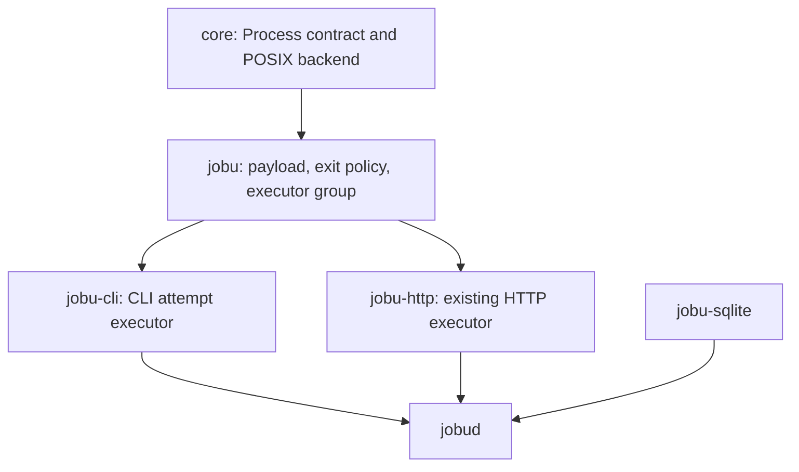
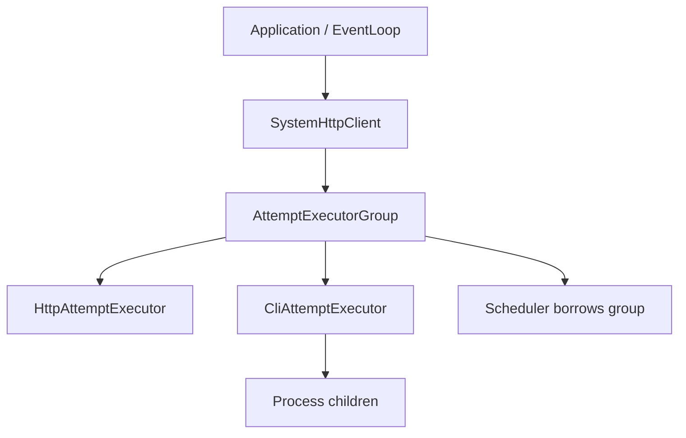

# JobU Phase 6 Code-Level Design

Status: implementation-ready design  
Baseline: `main` at `11bf10c1c5378af790c55842210091eb53f14e4b`  
Prepared: 2026-09-03

## 1. Purpose

Phase 6 adds asynchronous local command execution without weakening the durable scheduler boundary completed in
Phases 4 and 5. It introduces a project-owned, event-loop-driven `jb::core::Process`, a JobU CLI payload and result
policy, a CLI-capable `AttemptExecutor`, and daemon composition that allows HTTP and CLI jobs to run concurrently.

The Linux exit condition is concrete: `jobud` can execute multiple CLI attempts through the real `Scheduler`, drain
stdout and stderr without blocking, preserve bounded first/last output, classify exit and termination outcomes, and
terminate the complete process group on cancellation or timeout. Every target process still begins only after the
attempt's durable running transition commits.

Linux is implemented and verified first. The later macOS stages are separate mandatory approval boundaries and must
not be started until Linux delivery is complete. Phase 6 is complete only after both macOS stages and the final clean
Linux verification pass. Phase 7 remains responsible for startup recovery, daemon signal handling, and coordinated
service shutdown.

## 2. Baseline and repository evidence

This design is based on GitHub `main` at commit `11bf10c`, together with the Stage 5.32 closure handoff:

- the clean Linux build completed 315 build steps and all 98 registered tests passed;
- the SQLite-disabled configuration completed 244 build steps and is intentionally compile-only;
- the same source passed all 98 tests on macOS with the kqueue EventLoop backend;
- all 14 existing production `Object` subclasses use one `Object`-owned private-data block;
- `ManagementService::mutation_committed` is the reusable post-commit signal and daemon connections that capture an
  `Object` use receiver-aware slots;
- HTTP request and attempt completions remain exact-operation callbacks by design;
- `AttemptExecutor` already guarantees durable-before-start ordering and one asynchronous completion after each
  accepted start;
- `Scheduler` already accounts for CLI and HTTP concurrency independently, but its only real executor currently
  supports HTTP;
- `AttemptOutput` already maps runner-neutral `primary` and `diagnostic` channels to the existing stdout/stderr schema;
- output, attempt completion, retry or terminal run state, and recurrence are already committed atomically;
- the standard attributes already include `job.timeout`, `output.capture`, `output.stdout_limit`, and
  `output.stderr_limit`;
- CLI job documents currently accept `command` plus an optional string `arguments` array but are not executed;
- schema version 1, the 15-method management RPC set, and API version 1.1 are current; and
- no process abstraction, process watch, process group, or production CLI executor exists.

The current `main` revision remains the source of truth. If any implementation stage finds a material mismatch, stop
that stage, record the exact evidence, and revise this design before changing the architecture.

## 3. Scope

### 3.1 In scope

- A platform-neutral public `jb::core::Process` contract.
- A Linux process-exit watch integrated into the existing epoll EventLoop without a waiter thread.
- A private macOS `EVFILT_PROC` implementation in later mandatory stages after Linux delivery.
- Explicit executable and argument arrays; no implicit shell parsing.
- Completely explicit process environment and deterministic, resource-bounded `PATH` lookup.
- An absolute working directory, with `/` as the CLI default.
- A dedicated process group for every attempt.
- Nonblocking stdout and stderr pipes, drained to EOF or an explicit bounded capture-loss terminal.
- Exit-code, signal, start-failure, timeout, cancellation, and interruption distinctions.
- `SIGTERM` followed by configurable `SIGKILL` escalation.
- Forced cleanup of descendants that remain in the attempt's process group after its leader exits.
- Linux `PR_SET_NO_NEW_PRIVS` before target `execve()`.
- Descriptor, signal-disposition, and signal-mask hygiene in the child.
- Complete CLI payload decoding and management-time structural validation.
- Expected and retryable exit-code policy.
- Bounded first/last CLI output capture using the existing runner-neutral persistence contract.
- A CLI `AttemptExecutor` and an owned executor group that routes both CLI and HTTP attempts.
- Root-execution denial by default, with an explicit unsafe daemon override and a second check immediately before
  spawning.
- `jobud` and current `jobuctl job create` integration for the new CLI fields.
- API minor version 1.2 while preserving the existing 15 RPC methods.
- Linux unit, process, scheduler, and daemon integration tests with no external service dependency.
- Useful Doxygen for every new or changed public declaration.
- Concise implementation comments around non-obvious process, lifetime, security, ordering, and capture logic.

### 3.2 Explicitly out of scope

- Startup recovery of durable `running` attempts (Phase 7).
- `SIGTERM`/`SIGINT` daemon control, coordinated listener shutdown, or scheduler fatal-shutdown orchestration (Phase 7).
- Rewriting durable running attempts during ordinary process/executor destruction.
- Per-job operating-system users, namespaces, chroot, containers, seccomp, cgroups, rlimits, or resource accounting.
- Daemon privilege-drop configuration and service installation. The v1 deployment may run `jobud` as a dedicated
  account, but full privilege-drop startup belongs to a later deployment/configuration phase.
- Windows process execution. Unsupported platforms continue to fail clearly at configuration time.
- A shell command-string parser. Shell use is explicit as `command: "/bin/sh"` and `arguments: ["-c", "..."]`.
- Interactive stdin, PTYs, terminal emulation, merged output channels, or streaming output over RPC.
- Secret resolution or protected environment values (Phase 8). Phase 6 environment strings remain ordinary job data
  visible through the existing management API.
- Public Run Now, cancel, history, attempt-output, statistics, or secret RPC methods (Phase 8).
- General daemon configuration-file loading or environment inheritance.
- A database schema change or migration.
- Changes to HTTP payload, retry, redirect, TLS, capture, or result behavior.
- A second scheduler thread, a waiter thread per child, or polling `waitpid()` on a repeating timer.

The v1 technical plan uses “shutdown kill” in the Phase 6 runner bullet and separately assigns “immediate service
shutdown” to Phase 7. This design resolves those statements as two layers, not duplicate daemon work. Phase 6 provides
and tests the runner-level primitive: destroying an active `Process` or `CliAttemptExecutor` immediately kills and
reaps the owned CLI process group without rewriting durable state. Phase 7 owns the service-level trigger and ordering:
install daemon `SIGTERM`/`SIGINT` handling, stop mutation/dispatch admission, cancel HTTP work, invoke the CLI kill
primitive, close infrastructure, and exit promptly. Until Phase 7, default OS termination may bypass C++ destructors;
that explicit phase-boundary weakness is accepted because an intermediate phase is not the completed v1 service. Do
not move partial daemon signal handling into Phase 6. This staging clarification does not weaken the completed-v1
shutdown contract in technical-plan section 15.2.

## 4. Non-negotiable decisions

| Decision | Required result |
|---|---|
| Durable ordering | `Scheduler` commits the attempt/run running transition before the target can execute. |
| Process ownership | `Process` derives from `Object` and extends the single `ObjectPrivate` allocation; it has no second pimpl pointer or direct implementation-state member. |
| CLI executor ownership | `CliAttemptExecutor` derives from `Object` and `AttemptExecutor`, extends the same private block, and owns active `Process` children through the Object tree. |
| Notifications | Process lifecycle and output are signals; the one accepted attempt's completion remains `AttemptCompletionHandler`. |
| Receiver safety | Every Process signal slot that captures `CliAttemptExecutor` uses the executor as its receiver. |
| Event-loop model | Spawn, pipe I/O, process exit, timeout, cancellation, and completion run on one owner EventLoop thread. Every pipe callback has a finite read budget so output cannot starve timers or other readiness. |
| Readiness lifetime | Every Process fd/process readiness callback uses a one-way invalidatable per-registration anchor. Cleanup invalidates the anchor before attempting native removal or closing/resetting state, so retained or already-polled callbacks cannot access stale Process data. |
| Child monitoring | Linux uses pidfds registered one-shot with epoll; macOS uses one-shot `EVFILT_PROC` in the existing kqueue backend. No global `SIGCHLD` handler or waiter thread is added. |
| Reaping ownership | JobU retains the default, waitable `SIGCHLD` disposition and is the only code that may reap Process-owned child PIDs. |
| Spawn mechanism | Linux uses `_Fork()` followed by the bounded pre-exec path because portable `posix_spawn()` cannot perform `no_new_privs` between creation and target execution. The later macOS backend uses `fork()` with the explicitly scoped at-fork contract in section 10.6. |
| Start gate | The child cannot execute the target until parent-side pipe and process watches are registered successfully. A private Unix socket-pair gate uses platform no-`SIGPIPE` send support without inspecting or consuming host signals. |
| Child safety | All allocation, JSON/path parsing, vectors, signal sets, descriptors, and `char*` arrays are prepared before process creation; every blockable signal is blocked across creation and every catchable inherited disposition is reset before the clean target mask is installed. Process-controlled child code uses only async-signal-safe operations. |
| Environment | Target environment starts empty. Job-supplied entries and JobU metadata are the only entries. |
| PATH | Bare names require an explicit `PATH`; entries must be nonempty absolute directories, are searched in order, and have bounded count and expanded candidate storage. |
| Standard input | File descriptor 0 reads EOF from `/dev/null`; JobU never writes input in v1. |
| Output | stdout and stderr stay separate, are drained fairly in bounded chunks through EOF or an explicit bounded capture-loss terminal, and never become permanent process backpressure after capture limits. |
| Completion barrier | Reaping immediately enters non-signallable `Finishing` and invalidates PID/PGID state. `finished` is emitted only after both output pipes reach EOF or an explicit capture-loss condition, including forced closure at the bounded post-reap drain deadline. |
| Descendants | Every child is a process-group leader; stop signals target the group. Remaining same-group descendants are killed immediately after a natural leader exit, or at the existing grace deadline when a stopping leader exits early. |
| Timeout/cancel | Send `SIGTERM`, retain capacity, preserve an exited leader unreaped so the complete group receives `cli.termination_grace`, then send `SIGKILL` at the deadline if the group may remain. |
| Deadline arithmetic | Process captures one launch time and uses checked addition for the optional timeout. An unrepresentable absolute deadline is rejected before resource setup; unchecked `TimePoint + Duration` is forbidden. |
| Root policy | CLI execution is unavailable at effective UID 0 unless the explicit unsafe daemon override is set; the parent rechecks before spawn and `Process` authoritatively enforces the fixed policy in the child immediately before `execve()`. |
| Linux hardening | A Linux CLI child must successfully set `PR_SET_NO_NEW_PRIVS=1` before `execve()` or complete as a terminal start failure. |
| Executor routing | A generic owned executor group routes by `JobType`, rejects Object-derived executors that already have a parent, and outlives/destroys accepted child executors safely. Scheduler still borrows one `AttemptExecutor`. |
| Capture persistence | Existing `AttemptOutput` and schema-v1 stdout/stderr columns are reused unchanged. |
| Compatibility | Unknown additive CLI payload members remain preserved and ignored; old minimal payloads remain valid for absolute commands, while bare commands require an explicit valid payload `PATH`. |
| Error safety | Errors, results, and logs never contain command, arguments, paths, environment names/values, or output bytes. |
| Documentation | Every new/changed public declaration receives Doxygen and standalone first-include coverage in the same stage. |
| Code comments | Non-obvious implementation blocks explain why the ordering or mechanism exists, not merely restate the code. |
| `[[nodiscard]]` | Use it for fallible operations and meaningful value queries; do not force checks for routine cleanup or signal-like notification methods. |
| SQLite-disabled build | Configure and build it to prove target boundaries; do not run a duplicate no-SQLite CTest suite. |

## 5. Architecture and dependencies



Runtime ownership is:



The ownership arrows mean “must outlive” except that `AttemptExecutorGroup` owns both concrete executors and
`CliAttemptExecutor` owns its Process objects. `jobud` declares the HTTP client before the group and the scheduler after
the group. Destruction therefore stops the scheduler first, then destroys concrete executors while the group's routing
state still exists, and finally destroys the HTTP client.

The scheduler continues to receive exactly one `AttemptExecutor&`. No runner-specific include or switch is added to
the scheduler or persistence layer.

## 6. Target and source layout

### 6.1 `core` additions

Add:

```text
src/core/process.hpp                         public Process contract
src/core/process.cpp                         Object construction and public forwarding
src/core/process_priv.hpp                    ProcessPrivate : ObjectPrivate
src/core/process_request_priv.hpp/.cpp       validation and pre-fork argv/env/PATH preparation
src/core/process_posix_priv.hpp/.cpp         common pipes, socket gate, exec error, reaping, group stop
src/core/process_linux_priv.cpp              _Fork, pidfd, and no_new_privs operations
src/core/process_macos_priv.cpp              later mandatory fork/macOS platform operations
```

Update the private EventLoop backend contract and implementations:

```text
src/core/event_loop.hpp/.cpp
src/core/event_loop_backend.hpp
src/core/event_loop_backend_epoll.cpp
src/core/event_loop_backend_kqueue.cpp
```

`process.hpp` includes only project/standard headers. No `pid_t`, `siginfo_t`, epoll, kqueue, `wait*`, or `prctl` type
appears publicly.

### 6.2 Generic `jobu` additions

Add:

```text
src/jobu/attempt_executor_group.hpp/.cpp     owned routing AttemptExecutor
src/jobu/cli_job_payload_priv.hpp/.cpp       CLI decoder and structural policy
src/jobu/cli_exit_policy_priv.hpp/.cpp       exit selector and result mapping
src/jobu/cli_capture_priv.hpp/.cpp           bounded first/last stream retention
```

Update:

```text
src/jobu/job_validation_priv.hpp/.cpp
src/jobu/attribute_registry.hpp/.cpp
```

Management-time CLI validation belongs in generic `jobu` so invalid definitions are rejected without constructing a
platform Process or linking a concrete runner.

### 6.3 New `jobu-cli` target

Add:

```text
src/jobu/cli/CMakeLists.txt
src/jobu/cli/cli_attempt_executor.hpp         public
src/jobu/cli/cli_attempt_executor.cpp         Object-owned private implementation
src/jobu/cli/process_adapter_priv.hpp/.cpp    private Process operation/factory seam and production adapter
test/support/fake_process_adapter.hpp/.cpp    deterministic executor-only fake
```

The target links `jobu` only. It has no database, SQLite, curl, or platform library in its public interface. Platform
system calls remain inside `core`.

### 6.4 Daemon, client, and tests

Update `src/jobud/CMakeLists.txt` to link `jobu-cli`; keep `jobu-http`, `net-http`, and `jobu-sqlite` unchanged.

Add focused test support and tests:

```text
test/process-public-header-test.cpp
test/process-request-test.cpp
test/event-loop-process-watch-test.cpp
test/process-test.cpp
test/process-test-helper.cpp
test/attempt-executor-group-test.cpp
test/cli-job-payload-test.cpp
test/cli-exit-policy-test.cpp
test/cli-capture-test.cpp
test/cli-attempt-executor-test.cpp
test/cli-scheduler-integration-test.cpp
test/jobud-cli-integration-test.cpp
test/jobu-cli-public-header-test.cpp
```

Extend `test/support/fake_event_loop_backend.hpp` with process-watch operations and ready-process injection. Reuse the
existing temporary-directory, fake executor, scheduler, database, and durable-probe support where practical.

## 7. Public `jb::core::Process` contract

The final public shape is equivalent to the following. Exact formatting may follow repository conventions, but names,
ownership, and behavior are fixed by this design.

```cpp
namespace jb::core {

using ProcessEnvironment = std::map<std::string, std::string, std::less<>>;

enum class ProcessState : std::uint8_t {
    NotRunning,
    Starting,
    Running,
    Stopping,
    Finishing,
};

enum class ProcessExitKind : std::uint8_t {
    Exited,
    Signaled,
    TimedOut,
    Cancelled,
    Interrupted,
    StartFailed,
};

enum class ProcessStopReason : std::uint8_t {
    Cancelled,
    Interrupted,
};

struct ProcessStartInfo {
    std::string                     executable;
    std::vector<std::string>        arguments;
    ProcessEnvironment              environment;
    std::filesystem::path           working_directory{"/"};
    std::optional<Duration>         timeout;
    Duration                        termination_grace{std::chrono::seconds{5}};
    bool                            require_non_root{false};
    bool                            prevent_privilege_gain{false};
};

struct ProcessExit {
    ProcessExitKind                 kind{ProcessExitKind::StartFailed};
    std::optional<int>              exit_code;
    std::optional<int>              signal_number;
    std::optional<Error>            start_error;
    bool                            stdout_lost{false};
    bool                            stderr_lost{false};
};

class Process final : public Object {
public:
    explicit Process(Object* parent = nullptr);
    ~Process() override;

    Process(Process const&) = delete;
    Process(Process&&) = delete;
    auto operator=(Process const&) -> Process& = delete;
    auto operator=(Process&&) -> Process& = delete;

    [[nodiscard]] auto start(ProcessStartInfo start_info) -> Result<void, Error>;
    [[nodiscard]] auto stop(ProcessStopReason reason = ProcessStopReason::Cancelled)
        -> Result<void, Error>;

    [[nodiscard]] auto state() const noexcept -> ProcessState;
    [[nodiscard]] auto process_id() const noexcept -> std::optional<std::int64_t>;

    Signal<>            started;
    Signal<ByteBuffer>  standard_output;
    Signal<ByteBuffer>  standard_error;
    Signal<ProcessExit> finished;

private:
    struct Private;
};

} // namespace jb::core
```

All declarations, enum values, fields, signals, ownership constraints, timing, thread-affinity rules, and reentrancy
rules receive useful Doxygen in the actual header. The sketch omits comments only to keep this section readable.

### 7.1 State and call rules

- Construct and use a Process on one Object/EventLoop owner thread.
- The hosting process must not set `SIGCHLD` to `SIG_IGN` or use `SA_NOCLDWAIT`, and outside code must not call a
  wait function for a PID owned by Process.
- `started`, `standard_output`, `standard_error`, and `finished` may all use Direct delivery. A slot connected to any
  Process signal must not synchronously delete the sender; it must use `delete_later()`. The emitting readiness/output
  path may resume after the slot returns, and synchronous sender destruction would invalidate that path. This
  restriction and the permitted state-dependent reentrant calls are documented on every public signal.
- `start()` requires `NotRunning`, a valid current owner EventLoop, and a valid request.
- After successful acceptance, `state()` is normally `Starting`; no signal is emitted from inside `start()`. The
  pre-gate expired-timeout path below is also an accepted start but returns in `Stopping` with `TimedOut` fixed.
- `started` is emitted once when the gate was released and the exec-status channel reaches clean EOF without a complete
  child error record, and before any output signal is delivered. This is the strongest portable parent-side
  observation available from the close-on-exec protocol: it normally means `execve()` succeeded, but an asynchronous
  signal can terminate the child before `execve()` and close the writer without an error record. The public Doxygen
  must state this limitation and must not claim that the signal proves target code executed. Clean EOF after a gate
  that was deliberately left unreleased never emits `started`.
- When clean exec-status EOF is observed in `Starting`, `state()` becomes `Running` before `started` emission. If a
  stop reason was already accepted, state remains `Stopping`; `started` still reports the clean launch-channel outcome
  before any output or `finished` signal.
- The first `stop()` is valid in `Starting` or `Running`, sends `SIGTERM` to the process group, enters `Stopping`, and
  arms the request's `termination_grace` timer. `stop()` is also valid in `Stopping` only for the repeated-call rules
  below.
- Repeating `stop()` in `Stopping` with the same reason succeeds idempotently. A different reason returns
  `core.process.stop_conflict` and does not replace the first terminal cause. A call in `NotRunning` returns the stable
  `core.process.invalid_state` error.
- Immediately after the direct child is reaped, Process clears its child PID and process-group ID and enters
  `Finishing` before performing another output drain or invoking any user-visible signal. `Finishing` means no owned
  target can be signalled, but one or both output channels are still reaching EOF or their bounded loss terminal.
  `process_id()` is empty and `start()` remains invalid in this state.
- `stop()` in `Finishing` never invokes `kill()`. If an explicit stop reason was accepted earlier, repeating that same
  reason succeeds idempotently and a different reason returns `core.process.stop_conflict`; otherwise it returns
  `core.process.invalid_state`. A timeout-fixed result is not replaced by a later explicit stop.
- The request's `timeout`, when present, is monotonic and internally starts the same TERM-to-KILL path with
  `ProcessExitKind::TimedOut`. `start()` captures one `launch_time` before resource setup, validates and stores the
  checked absolute deadline, and later arms it with `EventLoop::post_at()`. The deadline therefore includes parent
  preparation and starts before the child gate is released; it is not recomputed or deferred until exec-status
  resolution.
- `finished` is emitted exactly once for every successful `start()` acceptance, including asynchronous start failure.
- Once both output channels are terminal, `state()` becomes `NotRunning` before `finished` emission; `process_id()` has
  already been empty since entry to `Finishing`. A direct slot may therefore schedule another start.
- A rejected `start()` emits no signal and leaves `NotRunning`.
- The destructor suppresses signals and invalidates every readiness anchor before attempting watch removal. It sends
  immediate `SIGKILL` and reaps only while native child/group identity is still valid, then closes descriptors. In
  `Finishing`, the identifiers are already invalid and destruction must not send a signal. It never calls user code.

### 7.2 Exit invariants

| Kind | `exit_code` | `signal_number` | `start_error` |
|---|---:|---:|---:|
| `Exited` | present | absent | absent |
| `Signaled` | absent | present | absent |
| `TimedOut` | exactly one of `exit_code` and `signal_number` is present | exactly one of `exit_code` and `signal_number` is present | absent |
| `Cancelled` | exactly one of `exit_code` and `signal_number` is present | exactly one of `exit_code` and `signal_number` is present | absent |
| `Interrupted` | exactly one of `exit_code` and `signal_number` is present | exactly one of `exit_code` and `signal_number` is present | absent |
| `StartFailed` | absent | absent | present |

For a stop reason, the semantic kind does not change if the target handles `SIGTERM` and exits normally. The observed
exit code or signal remains available as diagnostic metadata. `stdout_lost` and `stderr_lost` are independent flags and
do not change the leader's exit classification. A flag is set by an unrecoverable read failure or when the
corresponding reader must be closed at the bounded post-reap drain deadline.

A child terminated by a signal before `execve()` without writing a complete error record is classified from the
observed wait status, or from the already accepted cancellation/timeout reason. It is not reported as `StartFailed`
because the parent has no child error record proving which pre-exec step was active.

`[[nodiscard]]` applies to `start()`, `stop()`, `state()`, and `process_id()`. Signals and destructor cleanup do not
return forced-to-check results.

## 8. Process request validation and preparation

All potentially allocating work occurs before `_Fork()` on Linux or `fork()` on macOS:

1. validate owner-loop/state, capture one `launch_time`, and validate strings, environment, durations, and the checked
   timeout deadline;
2. build executable candidates;
3. build stable owning argv/environment string storage;
4. build null-terminated `char*` arrays whose pointers cannot be invalidated;
5. open `/dev/null`, create the internal/output pipes and start-gate socket pair, and normalize their descriptors above
   3;
6. cache the descriptor-close upper bound needed by the child fallback path; and
7. prepare the full blockable-signal set and clean target mask used around process creation.

### 8.1 Generic request rules

- `executable` is nonempty, contains no NUL, and is at most 4096 bytes.
- An absolute executable path is used as the only `execve()` candidate.
- A non-absolute executable must be a bare name containing no `/`.
- Every argument contains no NUL. At most 1024 arguments are accepted.
- Environment names match `[A-Za-z_][A-Za-z0-9_]*`, contain no `=`, and are unique by the map type.
- Environment values contain no NUL.
- The working directory is absolute, contains no NUL, and is at most 4096 bytes. Existence and directory access are
  checked authoritatively by child `chdir()` to avoid a time-of-check/time-of-use claim.
- `timeout`, when present, is positive and `launch_time + timeout` must fit in `TimePoint`; `termination_grace` is
  nonnegative and at most five minutes.
- `require_non_root` is an immutable launch policy copied into child-safe storage. A parent-side check may reject
  early, but the child check immediately before `execve()` is authoritative.
- The parent `SIGCHLD` disposition must retain waitable children; an ignored/no-wait disposition is rejected rather
  than overwritten process-globally.
- The aggregate bytes for argv and environment strings, including NUL terminators and pointer-array allowance, are at
  most 256 KiB and must also fit the runtime `_SC_ARG_MAX` safety margin.
- Invalid values return `InvalidArgument/core.process.invalid_request` with a fixed reason token in `detail`.

The private checked-deadline helper must never evaluate the potentially overflowing addition while validating it. For
a positive `Duration`, compare the base time against `TimePoint::max() - duration`; construct `base + duration` only
after that comparison succeeds. `start()` passes its single captured `launch_time` through this helper and retains the
returned absolute deadline. Failure uses the fixed safe detail token `timeout.deadline_out_of_range` and occurs before
opening descriptors or creating a child. Do not impose JobU's 30-day policy on the reusable Process API: JobU already
validates `job.timeout` separately, while Process accepts every positive timeout representable from the captured base.

### 8.2 Deterministic PATH lookup

For a bare executable name:

- `PATH` must exist in the supplied `ProcessEnvironment`;
- split it only on `:`;
- every entry must be nonempty and absolute;
- at most `kMaxPathEntries = 256` entries are accepted;
- do not interpret an empty entry as the working directory;
- prebuild one `directory/name` candidate per entry in parent memory;
- the aggregate size of the fully joined candidate strings, including one NUL terminator per candidate, must not
  exceed `kMaxPathCandidateBytes = 256 KiB`;
- the child tries candidates in order with `execve()`;
- `ENOENT` and `ENOTDIR` advance to the next candidate;
- remember `EACCES` and return it if no later candidate succeeds;
- another error terminates the search immediately.

No ambient `getenv("PATH")`, `execvp()`, shell lookup, tilde expansion, variable interpolation, or current-directory
search is allowed. The entry-count and expanded-candidate limits are independent of the argv/environment aggregate
limit in section 8.1: the former bound parent preparation memory, while the latter bounds the eventual `execve()`
request. Invalid count or expansion returns `core.process.invalid_request` with a fixed PATH reason token.

## 9. EventLoop process-watch extension

The Process public API does not expose a process-watcher type. `EventLoop` privately gains a friend-only child watch
used by Process:

```cpp
namespace jb::core::priv {

enum class ReadyEventKind : std::uint8_t { FileDescriptor, Process };

enum class ProcessRegistrationResult : std::uint8_t {
    Added,
    Unsupported,
    Failed,
};

struct ReadyEvent {
    ReadyEventKind kind{ReadyEventKind::FileDescriptor};
    std::int64_t   ident{-1};
    FdEvents       events;
};

class Backend {
public:
    virtual auto add_process(std::int64_t process_id) -> ProcessRegistrationResult = 0;
    virtual auto remove_process(std::int64_t process_id) -> bool = 0;
    // Existing fd and poll operations remain.
};

} // namespace jb::core::priv
```

`EventLoop` keeps a loop-thread-only process-callback map and dispatches process events separately from fd events.
These callbacks remain private EventLoop readiness callbacks; they are not substitutes for public Process signals.

### 9.1 Linux epoll backend

- `add_process()` invokes `pidfd_open(pid, 0)` through the Linux syscall interface and registers the returned
  close-on-exec descriptor with `EPOLLIN | EPOLLONESHOT`. It returns `Unsupported` only when native process monitoring
  is unavailable and `Failed` for pidfd or epoll registration failures on an otherwise supported kernel.
- The backend owns maps in both directions so a pidfd readiness event becomes a typed process event, never an
  accidental user fd event.
- Process pidfds are never rearmed after readiness delivery. A pidfd remains readable after child exit, so one-shot
  registration prevents a failed `remove_process()` from returning the same retained registration on every subsequent
  `epoll_wait()` and driving the EventLoop into a busy loop.
- A child remains behind the start gate until registration succeeds, eliminating the fast-exit registration race.
- `remove_process()` removes the epoll registration, closes the pidfd, and erases both maps transactionally.
- `Unsupported` maps to the safe `core.process.monitor_unsupported` start rejection; `Failed` maps to
  `core.process.watch_failed`. Supported v1 Linux distributions have suitable kernels; no `SIGCHLD` thread or
  timer-poll fallback is introduced.
- When notified, Process sends group-cleanup signals as needed and calls `waitpid(pid, ..., WNOHANG)` with EINTR retry.
  The direct child is reaped exactly once.

### 9.2 macOS kqueue backend

The later mandatory macOS stage implements the same backend methods with `EVFILT_PROC`, `NOTE_EXIT`, and `EV_ONESHOT`
in the existing EventLoop kqueue. The event kind distinguishes a process identifier from an fd identifier. The common
start gate makes registration occur while the child is alive.

The design intentionally does not install a process-global `SIGCHLD` handler. pidfd and `EVFILT_PROC` provide scoped
child readiness and avoid handler ownership conflicts. Phase 7 may add separate EventLoop signal-watching support for
daemon `SIGTERM` and `SIGINT`; it must not replace this process watch without new evidence.

### 9.3 Process callback lifetime and failed removal

`EventLoop::unwatch_fd()` and the private process-watch removal operation may fail while retaining the old callback
registration. Closing a descriptor also does not make a retained C++ callback safe, and an event already returned by
the backend may still be waiting for EventLoop dispatch. Process must therefore not rely on successful native removal
for callback lifetime.

Each accepted readiness registration—stdout, stderr, exec status, and process exit—gets a distinct private shared
anchor. The EventLoop callback captures only a weak reference to that anchor, never an unguarded Process/private-data
pointer. The anchor identifies its owner and accepted-start generation while valid. Before every removal attempt,
descriptor close, per-run reset, or Process destruction, invalidate the affected anchor first. A callback whose weak
anchor expired, is invalid, or belongs to an old generation returns without accessing Process state or reposting work.
Anchors are one-way: a subsequent `start()` creates new anchors rather than reactivating an old one.

This rule also applies when an observed stopping leader's process watch is retired before reap and when the post-reap
deadline forcibly closes an output reader. Output-drain continuations additionally keep the receiver-bound Object
lifetime rule in section 10.5. Persistent fake-backend removal failure must prove that later injected readiness,
already-polled dispatch, Process reset/restart, and destruction all become safe no-ops for the invalid registration.
On Linux, `EPOLLONESHOT` separately guarantees that a delivered pidfd registration retained after removal failure does
not become continuously ready: later nonblocking polls produce no further event unless explicitly rearmed, and process
watches are never rearmed. The invalidatable anchor remains mandatory because one-shot registration does not make an
event already returned by `epoll_wait()` safe to dispatch after cleanup.

## 10. POSIX spawn, I/O, and completion ordering

### 10.1 Descriptor set

Before platform child creation, create:

- stdout pipe: blocking child writer, nonblocking close-on-exec parent reader;
- stderr pipe: blocking child writer, nonblocking close-on-exec parent reader;
- exec-status pipe: fixed-size child error record, close-on-exec writer;
- start-gate Unix-domain stream socket pair: the child blocks until parent setup succeeds, while the parent endpoint
  supports platform-local no-`SIGPIPE` send; and
- a read-only `/dev/null` descriptor for stdin.

All creation and required parent-end socket option setup are checked. A failure closes every previously created
descriptor and returns without creating a child.

Every descriptor created for Process is normalized to a value greater than 3 before process creation. If an
`open()` or pipe operation returns 0, 1, 2, or 3 because the embedding process had closed a conventional descriptor,
duplicate it with close-on-exec semantics to the first available descriptor above 3 and close the original. Complete
normalization before building the child descriptor plan. The child may then map the prepared `/dev/null`, stdout,
stderr, and exec-status sources collision-safely onto 0, 1, 2, and 3 respectively; no still-needed source descriptor
may equal or be overwritten by an earlier destination. Set `FD_CLOEXEC` on the final exec-status descriptor after
remapping. This normalization is distinct from Stage 6.6's later cleanup of unrelated inherited descriptors.

### 10.2 Parent sequence

1. Block every blockable signal in the calling thread and retain its original mask.
2. Call Linux `_Fork()` or the macOS backend's `fork()` while those signals are blocked.
3. In the parent, restore the original signal mask immediately on both success and failure paths.
4. Close child-only descriptor ends.
5. Establish the child process group from the parent side while the child remains gated.
6. Register stdout, stderr, exec-status, and process-exit watches.
7. Enter `Starting` and arm the monotonic timeout from the accepted-launch deadline.
8. Immediately before gate send, compare a fresh `Clock::now()` with the stored deadline and take the accepted
   pre-gate timeout path below when it is already expired.
9. Send exactly one gate byte through the platform-local no-`SIGPIPE` socket operation described below and close the
   gate endpoint.
10. Record that the gate was released and return success.
11. On clean exec-status EOF after gate release, apply section 7.1's state rule and emit `started`; do not restart or
    extend the timeout.

If any step before gate release fails, cancel an armed timeout, close the gate, kill the still-non-executing child,
reap it synchronously, clean all resources, restore the parent signal mask if it has not yet been restored, and return
a start error with no signal obligation.

Deadline expiry at step 8 is not a start rejection because child ownership, process-group identity, and every watch
have already been accepted. Cancel the queued timeout handle, fix the semantic result as `TimedOut`, enter `Stopping`,
leave `gate_released=false`, close the parent gate endpoint without sending a byte, and immediately send `SIGKILL` to
the still-gated process group. The target has not received permission to execute, so termination grace does not apply.
Keep the process/output/exec-status watches and return success without emitting a signal inside `start()`. Gate EOF
causes the child to exit without `execve()`; its clean exec-status EOF is not a `started` observation. Normal readiness,
reaping, `Finishing`, and output-terminal processing then emit exactly one `finished` with kind `TimedOut`. A group-kill
failure is logged with only safe fixed diagnostics and does not turn the accepted outcome into a synchronous error;
gate EOF still provides the normal child-exit path.

The immediate check prevents Process from knowingly releasing a child after parent preparation consumed the entire
timeout. It does not claim real-time execution at the exact deadline: when the check succeeds, scheduling can still
advance before the child reaches `execve()`, and the already-armed EventLoop timeout remains the enforcement mechanism.

Gate release must not rely on a process-global ignored `SIGPIPE`, temporary thread masking, pending-signal inspection,
or `sigwait()` consumption. The gate is a Unix-domain stream socket pair created and normalized before process
creation. Linux sends the byte with `send(..., MSG_NOSIGNAL)`. The macOS setup enables `SO_NOSIGPIPE` on the parent's
sending endpoint before `fork()` and then uses `send()`. These operations atomically suppress only a gate-send-generated
`SIGPIPE`; a host signal already pending or concurrently directed to the owner thread remains untouched.

Retry `send()` on `EINTR`. `EPIPE`, connection reset, a zero/short transfer, or another terminal send failure is a
controlled start rejection: cancel the launch timeout, kill/reap if still necessary, invalidate every callback anchor
before removing registered watches, close all descriptors, and return `core.process.child_setup_failed` with a fixed
safe gate-failure detail token. A successful `start()` is never reported for a child that disappears before gate
release.

### 10.3 Child sequence

The child branch uses prebuilt buffers and fixed records only:

1. close parent-only descriptor ends;
2. read the gate byte from the child socket endpoint; EOF means exit immediately without executing a target;
3. make itself process-group leader with `setpgid(0, 0)`;
4. collision-safely duplicate the normalized `/dev/null`, stdout, stderr, and exec-status sources onto descriptors 0,
   1, 2, and 3, then set close-on-exec on descriptor 3;
5. close the now-unneeded normalized source descriptors;
6. close or mark close-on-exec every unrelated inherited descriptor;
7. while all blockable signals remain blocked from the parent, restore every catchable signal disposition to
   `SIG_DFL`; `SIGKILL` and `SIGSTOP` are excluded because they cannot be caught or reset;
8. install the prepared clean target mask, which unblocks every blockable signal;
9. `chdir()` to the requested directory;
10. on Linux when requested, set `PR_SET_NO_NEW_PRIVS=1` and verify it;
11. when `require_non_root` is true, reject effective UID 0 immediately before entering the exec candidate loop;
12. try the prepared `execve()` candidates in order;
13. on any failure, write one fixed `{stage, errno}` record and call `_exit(127)`.

No Process-controlled logging, allocation, mutex, filesystem object, `strerror()`, exception, iostream, fmt, user
callback, or inherited application signal handler is used after the platform child-creation call returns in the child
and before `execve()`.

### 10.4 Inherited descriptor cleanup

The child must not leak the database, local listener, client sockets, curl sockets, or unrelated embedding-process
descriptors into the target:

- Linux first uses `close_range()` where available, preserving descriptors 0 through 3; an `ENOSYS` fallback closes
  the precomputed bounded descriptor range one fd at a time.
- macOS uses the native close-from mechanism or the same bounded close loop.
- the exec-status descriptor is `FD_CLOEXEC` and is the only descriptor above stderr intentionally alive until exec;
- tests deliberately create unrelated non-CLOEXEC descriptors and prove they are absent in the helper target.

### 10.5 Output and finish barrier

- Each readiness callback reads at most `kPipeReadBudgetBytes = 256 KiB`, using reads no larger than
  `kPipeReadChunkBytes = 64 KiB`. It stops earlier on EOF, `EAGAIN`, or an unrecoverable error.
- Nonempty chunks are emitted in byte order through `standard_output` or `standard_error`; the budget counts bytes
  read, independently for each callback and channel. After every emission the callback may continue its bounded drain;
  section 7.1's prohibition on synchronous sender deletion therefore applies even when the slot does not itself call a
  Process method.
- Reaching the byte budget before a terminal read schedules one coalesced, receiver-bound continuation for that
  channel. The continuation clears its pending flag and performs another bounded drain. If it also exhausts the
  budget, it reposts itself for a later EventLoop cycle. A readiness event and a pending continuation must never queue
  duplicate drains for the same channel.
- The continuation uses the Process Object's lifetime-aware event delivery, not a context-free lambda retaining a raw
  Process pointer. Because watcher callbacks return after a finite budget, EventLoop can fire expired timers and
  dispatch other ready descriptors. Explicit continuation is required for edge-triggered backends because Process may
  deliberately stop reading while the fd remains readable and therefore cannot wait for another readiness edge.
- If output becomes ready before exec-status resolution, first drain the exec-status pipe. Target output cannot be
  produced before a successful exec, so this guarantees the observable `started` notification precedes output.
- A child-exit callback observed while state is `Starting` performs the same exec-status drain before classifying the
  exit. Clean EOF after gate release emits `started` before `finished`, including for a target that execs and exits
  immediately. A complete child error record instead produces only `StartFailed`. Clean EOF is not described as proof
  of exec success because pre-exec signal death can close the pipe without writing a record. The known-unreleased
  timeout path suppresses `started` regardless of clean EOF.
- EINTR retries. An unrecoverable pipe-read error marks that channel lost, closes it, and continues termination/reaping.
- The two channels have no ordering guarantee relative to each other; order within each channel is preserved.
- Process does not retain a cumulative output buffer.
- A child-exit notification alone is not completion. Process waits until both output readers reached EOF or were
  marked lost.
- For a leader exit outside `Stopping`, or after zero/expired stopping grace, send `SIGKILL` to the still-existing
  process group before reaping. Keep the leader unreaped until this group kill is attempted so its PID/PGID cannot be
  reused. This prevents an unjoined same-group descendant from surviving the attempt.
- If leader exit readiness arrives in `Stopping` while grace remains, record `leader_exit_observed`, remove the
  process-readiness watch so it cannot redispatch, but deliberately do not reap the child or send an early `SIGKILL`.
  Invalidate that registration's callback anchor before attempting removal. Continue bounded output draining and
  retain scheduler capacity. Keeping the leader as an owned zombie prevents PID/PGID reuse while every descendant
  receives the complete configured TERM grace.
- At the grace deadline, send `SIGKILL` to the process group. If `leader_exit_observed` is set, reap the retained leader
  immediately afterward; otherwise keep the process-exit watch and reap when exit readiness arrives. The cleanup
  signal does not replace the recorded cancellation or timeout outcome. Even if both output pipes reached EOF, a
  retained leader is not reaped or completed early because pipe closure does not prove that every same-group
  descendant has exited.
- Immediately after any successful direct-child reap, invalidate the process-watch anchor and clear the stored child
  PID and process-group ID before another drain, signal emission, or reentrant call can occur. Enter `Finishing`; no
  path from this point may call `kill()` with the former numeric identifiers. Then drain both output readers again. If
  either reader is still open, arm the private monotonic `kPostReapDrainTimeout = 1s` deadline while normal readiness
  draining continues. EOF on both channels cancels that deadline and permits completion.
- When the post-reap deadline expires, cancel any pending continuation and give each remaining reader one final
  `kPipeReadBudgetBytes` drain only. Do not loop through `EAGAIN` and do not repost. If EOF is not reached within that
  finite drain, invalidate its callback anchor before unwatching and closing the reader, then mark only that channel
  lost. This bounds completion when a descendant escaped the process group or continuously writes through a retained
  output descriptor, without discarding already readable tail bytes within the final budget or weakening the normal
  EOF path.
- Invalidate every remaining registration anchor before attempting watch removal, cancel every timer, release handles,
  and enter `NotRunning` before emitting `finished`. Failed backend removal may retain only a callback whose anchor is
  permanently inert.

Descendants that deliberately create a new session or process group are outside the v1 guarantee. Tests cover normal
forked descendants that remain in the attempt group. Escaping the group does not, however, permit a descendant to
retain scheduler capacity indefinitely; the bounded output-terminal rule above still applies.

### 10.6 Platform child-creation and at-fork boundary

The Linux backend uses POSIX `_Fork()`, not `fork()`. Supported Linux configurations must expose `_Fork()` at compile
and link time; otherwise configuration rejects the Process backend. `_Fork()` bypasses application
`pthread_atfork()` handlers and returns directly into the prepared Process child branch, so the Linux async-signal
safety review covers the complete post-creation/pre-exec interval controlled by the application.

The later macOS backend uses the public `fork()` API because macOS does not expose `_Fork()` and its `vfork()`
alternative is deprecated. The macOS guarantee is therefore scoped precisely: Process-controlled code after
`fork()` returns in the child uses only async-signal-safe operations, while process-global handlers registered through
`pthread_atfork()` belong to the host runtime and may run inside `fork()`. `jobud` itself must not register an
application at-fork handler. Stage 6.17 must audit this boundary on the supported macOS toolchain and must not call a
private libc entry point or introduce a helper-process architecture without a separately approved design revision.

## 11. Stop, timeout, and destruction semantics

### 11.1 Cancellation and timeout

`Process::stop(Cancelled)` and the automatic timeout path share one state machine:

1. send `SIGTERM` to `-pgid`;
2. after successful delivery or `ESRCH`, record the first semantic stop reason;
3. enter `Stopping`;
4. if grace is zero, send `SIGKILL` immediately; otherwise arm one monotonic timer;
5. if leader exit is observed before the timer expires, remove its readiness watch but retain it unreaped and continue
   bounded pipe draining without sending early `SIGKILL`;
6. when the timer expires, send `SIGKILL` to `-pgid`, then reap an already-observed retained leader or wait for the
   still-running leader's exit readiness;
7. immediately after the group-kill attempt and leader reap, clear PID/PGID, enter non-signallable `Finishing`, and
   start the post-reap output barrier; and
8. finish only after both output channels reach EOF or their bounded loss terminal.

`ESRCH` is success when the process group is already gone. Other initial `kill()` failures return
`core.process.signal_failed` from an explicit `stop()` without changing state or terminal cause, so the caller may
retry and the attempt remains active. The automatic timeout path cannot return an error: it records `TimedOut`, logs
only the stable safe failure, and still schedules the KILL escalation and waits for terminal observation. No capacity
is released merely because TERM or KILL was sent.

The grace period belongs to the process group, not only its leader. A leader that handles TERM and exits promptly does
not shorten descendant grace. Retaining that exited leader may delay completion until the configured deadline even
when both output channels already reached EOF; this is intentional because v1 has no portable race-free proof that
the process group contains no other member while preserving the PGID against reuse.

EventLoop watcher processing precedes timer delivery in a cycle. Therefore an already-observed natural child exit wins
over a timeout in that cycle; once the timeout transition begins, its semantic result remains `TimedOut` even if the
child handles TERM and exits with a code.

### 11.2 Destruction and future Phase 7 interruption

Process destruction is fail-safe cleanup, not a normal completion:

- disconnect/suppress outgoing signals;
- permanently invalidate all readiness anchors, then cancel timers and attempt to remove watches;
- send immediate `SIGKILL` only when an unreaped child's process-group ID remains valid;
- close pipe readers;
- synchronously reap the direct child with EINTR handling when it has not already been reaped;
- never signal a saved numeric identifier after entry to `Finishing`; and
- return without emitting `finished`.

`ProcessStopReason::Interrupted` and `ProcessExitKind::Interrupted` reserve an explicit observed interruption for a
future coordinated caller. `CliAttemptExecutor` does not use that result during Phase 6 normal execution. Phase 7 may
use immediate interruption or destroy executors while deliberately leaving durable attempts running for recovery, but
that policy is not implemented here.

Process and executor destruction are the Phase 6 “shutdown kill” mechanism required by the runner contract. They do
not make ordinary daemon `SIGTERM` or `SIGINT` safe by themselves because default signal termination does not unwind
the object tree. Phase 7 must call this proven mechanism from its coordinated service-shutdown path after closing
admission, as section 3.2 specifies.

## 12. CLI job payload contract

### 12.1 JSON shape

The final decoded shape is:

```json
{
  "command": "tool-or-absolute-path",
  "arguments": ["arg-1", "arg-2"],
  "working_directory": "/absolute/path",
  "environment": {
    "NAME": "value",
    "REMOVE_ME": null
  },
  "expected_exit_codes": [0]
}
```

Only `command` is syntactically required. An absolute command works with the defaults below; a bare command also
requires `environment.PATH` to set one valid explicit search path.

Defaults are:

| Member | Default |
|---|---|
| `arguments` | empty array |
| `working_directory` | `/` |
| `environment` | empty patch |
| `expected_exit_codes` | `[0]` |

A string environment value sets or replaces the entry. JSON `null` removes it from the effective explicit
environment. Phase 6 starts from an empty environment, so a removal may be a no-op; defining removals now preserves the
contract for Phase 8's resolved secret/environment layers. The three `JOBU_*` entries are injected afterward.

Unknown top-level members remain preserved in durable JSON and ignored by a Phase 6 decoder. Nested `environment`
members are data keys, not protocol extensions.

### 12.2 Validation limits

- `command` follows section 8's absolute-path-or-bare-name rule.
- For a bare command, the effective explicit environment must contain `PATH` as a string. Missing `PATH`, a `null`
  removal, an empty value, an empty entry, or any relative entry is rejected at management time using section 8.2's
  exact splitting rules. Exceeding the mirrored `kMaxPathEntries` or `kMaxPathCandidateBytes` contract is also
  rejected. An absolute command does not require `PATH` and creates no candidate expansion.
- `arguments` contains at most 1024 strings; every value is NUL-free.
- `working_directory`, when present, is a NUL-free absolute path of at most 4096 bytes, matching Process validation.
- `environment` contains at most 256 entries.
- Environment names follow the Process grammar.
- `JOBU_JOB_ID`, `JOBU_RUN_ID`, and `JOBU_ATTEMPT` cannot be supplied or removed by a job.
- Every environment value is a NUL-free string or null.
- `expected_exit_codes` contains at most 256 unique unsigned integers from 0 through 255. The explicit empty array is
  valid and means no numeric exit code is successful.
- The existing deterministic 256 KiB serialized payload limit remains authoritative, but is not sufficient by itself.
  Management validation also calculates the final prepared argv/environment size using the same documented formula as
  Process: string NUL terminators, both terminating pointer arrays, `sizeof(char*)`, and the three injected metadata
  entries. Because job and run IDs do not yet exist at job-definition validation, reserve their canonical 36-character
  UUID values and the maximum 20 decimal digits of `AttemptNumber`. A payload is rejected unless this worst-case
  prepared request remains within 256 KiB. Process repeats the calculation with actual values and the runtime
  `_SC_ARG_MAX` margin immediately before launch.

Boundary cross-tests must prove that every management-accepted maximum payload plus worst-case metadata passes the
Process deterministic aggregate check, and that every accepted bare-command PATH passes Process's entry-count and
expanded-candidate checks. Keep the mirrored implementations adjacent to named constants and update both in one stage
if the Process formula, PATH expansion policy, or injected metadata changes.

Expand `JobPayloadIssue` with safe reason tokens for invalid command, working directory, environment, PATH, prepared
aggregate size, and expected exit codes. Management continues mapping them to `jobu.job.invalid_payload` without
including rejected values.

### 12.3 No implicit shell

`command: "echo hello"` is one executable name and does not invoke a shell. Redirection, pipes, wildcard expansion,
quotes, substitutions, and environment interpolation are never parsed. A shell job is explicit:

```json
{
  "command": "/bin/sh",
  "arguments": ["-c", "printf '%s\\n' hello"]
}
```

## 13. CLI attributes

Add two standard definitions, increasing the fixed standard registry from 19 to 21 entries:

| Name | Type | Built-in default | Validation |
|---|---|---|---|
| `cli.termination_grace` | Duration | 5000 ms | 0 through 300000 ms |
| `cli.retry_exit_codes` | List | `["0-255"]` | at most 64 unique normalized selectors |

An exit-code selector is either one canonical decimal integer `0` through `255` or one inclusive ascending range such
as `1-3`. Leading zeros, whitespace, signs, descending ranges, empty ranges, overlaps, and duplicates are rejected.
The decoder sorts and merges adjacent selectors into a private membership set after validation.

Outcome evaluation checks `expected_exit_codes` first. Therefore the default retry set may include 0 without changing
success. When a numeric exit is unexpected:

- membership in `cli.retry_exit_codes` produces `FailureDisposition::Retryable`;
- non-membership produces `FailureDisposition::Terminal`; and
- an empty list makes every unexpected numeric exit terminal.

Both attributes accept daemon-default, queue-default, and job scopes like the existing execution attributes. Old
materialized snapshots acquire both built-in defaults during decode; schema version remains 1.

## 14. CLI environment and metadata

For each attempt, `CliAttemptExecutor` creates a new `ProcessEnvironment` from no ambient base and applies:

1. Phase 6 literal payload environment entries/removals;
2. future resolved environment/secret layers, currently absent; then
3. mandatory JobU metadata, overriding no user value because reserved names were rejected.

Injected values are:

```text
JOBU_JOB_ID=<job UUID>
JOBU_RUN_ID=<run UUID>
JOBU_ATTEMPT=<positive attempt number>
```

`JOBU_RUN_ID` is the durable run ID and remains stable across retries. `JOBU_ATTEMPT` increments. JobU injects no
implicit `PATH`, `HOME`, locale, temporary-directory, proxy, credential, loader, or platform variable.

For Phase 6, literal environment values are not secrets. They are persisted in the job payload and returned by
existing job management reads. Documentation and logs must not suggest otherwise. Phase 8 will add protected secret
references without changing Process's explicit-environment contract.

## 15. `CliAttemptExecutor`

The final public shape is:

```cpp
namespace jb::jobu::cli {

struct CliAttemptExecutorOptions {
    bool allow_root{false};
};

class CliAttemptExecutor final : public jb::core::Object,
                                 public jb::jobu::AttemptExecutor {
public:
    explicit CliAttemptExecutor(CliAttemptExecutorOptions options = {},
                                jb::core::Object* parent = nullptr);
    ~CliAttemptExecutor() override;

    CliAttemptExecutor(CliAttemptExecutor const&) = delete;
    CliAttemptExecutor(CliAttemptExecutor&&) = delete;
    auto operator=(CliAttemptExecutor const&) -> CliAttemptExecutor& = delete;
    auto operator=(CliAttemptExecutor&&) -> CliAttemptExecutor& = delete;

    [[nodiscard]] auto is_available(JobType type) const noexcept -> bool override;
    [[nodiscard]] auto start(AttemptStartRequest request,
                             AttemptCompletionHandler completion)
        -> jb::core::Result<void, jb::core::Error> override;
    [[nodiscard]] auto cancel(AttemptKey const& key)
        -> jb::core::Result<void, jb::core::Error> override;

private:
    struct Private;
};

} // namespace jb::jobu::cli
```

The actual header provides Doxygen for ownership, owner thread, callback timing, root policy, and stable errors.
`CliAttemptExecutor` contains no direct `_data` member: its `Private` inherits `jb::core::priv::ObjectPrivate` and is
allocated through the protected Object constructor. The private owner back-reference is assigned only after base
construction.

### 15.1 Active-attempt ownership

The private data maps `AttemptKey` to an active record containing:

- one private `ProcessAdapter` operation handle;
- expected and retryable exit sets;
- capture mode and two bounded capture buffers;
- the exact `AttemptCompletionHandler`; and
- completion/cancellation guards.

`ProcessAdapter` is a private non-Object strategy used only to keep stages 6.10 and 6.12 independently verifiable. Its
test implementation accepts `start()`/`stop()` calls and produces deterministic operation events without launching a
child. Its production implementation creates a `Process` owned as a `CliAttemptExecutor` Object child and forwards
start/stop to it. The production adapter connects `Process::standard_output`, `standard_error`, and `finished` with
receiver-aware connections whose receiver is the `CliAttemptExecutor`; it does not replace those reusable public
Process events with a production callback API. Private adapter event sinks are permitted only as the documented
non-Object test seam and never appear in a public header.

Each production slot may capture the executor and attempt key because receiver lifetime tracking deactivates it before
private data can disappear. The adapter does not own a second private-data block for the executor or the Process: the
executor and every production Process continue to use their respective Object-owned private allocations.

On Process finish:

1. verify the active key and operation identity;
2. map the exit to one owning `AttemptCompletion`;
3. decide whether captured output is retained;
4. move the attempt completion handler out;
5. erase every executor-owned active reference;
6. retire the adapter and schedule its production Process with `delete_later()`; then
7. invoke the exact completion callback once.

Retiring internal state before user code preserves safe reentrancy into `start()` or `cancel()`.

### 15.2 Start and cancellation

`is_available()` is true only for `JobType::Cli`, with a valid owner EventLoop and an allowed effective identity. It is
false for HTTP and unknown enum values.

`start()`:

- rejects non-CLI, empty completion, invalid key, duplicate key, invalid durable payload/attributes, unavailable loop,
  and root policy violations;
- decodes the immutable snapshot again and treats a mismatch as `jobu.cli.invalid_snapshot`;
- checks effective UID immediately before the adapter's start operation;
- creates the adapter, inserts the active record, and starts it; the production adapter creates a child Process and
  installs receiver-aware signal connections before calling `Process::start()`;
- on start rejection, removes all state, deletes the adapter and any Process child without a callback, and returns a
  safe error; and
- after acceptance, invokes the completion only from a later adapter event originating from a Process signal in
  production, never inside `start()`.

`cancel()` finds the exact active operation and calls `stop(Cancelled)`. Success retains the completion obligation and
capacity until the production Process `finished` signal or corresponding fake event. An unknown key returns
`jobu.cli.attempt_not_found`.

The destructor disables Process slots/completions and lets Object-owned child destruction perform immediate group kill
and reaping without invoking scheduler callbacks. Phase 7 remains responsible for the corresponding daemon durable
recovery policy.

## 16. Attempt result mapping

### 16.1 Outcome table

| Process observation | Attempt outcome | Failure disposition |
|---|---|---|
| expected numeric exit | `Succeeded` | absent |
| unexpected numeric exit in `cli.retry_exit_codes` | `Failed` | `Retryable` |
| unexpected numeric exit outside retry set | `Failed` | `Terminal` |
| unrequested signal termination | `Failed` | `Retryable` |
| timeout | `Failed` | `Retryable` |
| explicit cancellation | `Cancelled` | absent |
| async child-setup/exec/chdir/security start failure | `Failed` | `Terminal` |

`Interrupted` is not emitted by normal Phase 6 CLI attempts. Executor destruction suppresses the callback so durable
running state remains available to Phase 7 recovery.

### 16.2 Stable result objects

Use these bounded shapes, with keys serialized deterministically by `JsonValue::Object`:

```json
{
  "capture_lost": false,
  "exit_code": 0,
  "outcome": "success",
  "stderr": {"captured_bytes": 0, "total_bytes": 0, "truncated": false},
  "stdout": {"captured_bytes": 12, "total_bytes": 12, "truncated": false},
  "type": "cli"
}
{
  "capture_lost": false,
  "exit_code": 2,
  "outcome": "unexpected_exit",
  "stderr": {"captured_bytes": 8, "total_bytes": 30, "truncated": true},
  "stdout": {"captured_bytes": 0, "total_bytes": 0, "truncated": false},
  "type": "cli"
}
{
  "capture_lost": false,
  "outcome": "signal",
  "signal": 15,
  "stderr": {"captured_bytes": 0, "total_bytes": 0, "truncated": false},
  "stdout": {"captured_bytes": 0, "total_bytes": 0, "truncated": false},
  "type": "cli"
}
{
  "capture_lost": false,
  "outcome": "timeout",
  "signal": 9,
  "stderr": {"captured_bytes": 0, "total_bytes": 0, "truncated": false},
  "stdout": {"captured_bytes": 0, "total_bytes": 0, "truncated": false},
  "type": "cli"
}
{
  "capture_lost": false,
  "outcome": "cancelled",
  "signal": 15,
  "stderr": {"captured_bytes": 0, "total_bytes": 0, "truncated": false},
  "stdout": {"captured_bytes": 0, "total_bytes": 0, "truncated": false},
  "type": "cli"
}
{
  "capture_lost": false,
  "error_code": "core.process.exec_failed",
  "outcome": "start_failure",
  "stderr": {"captured_bytes": 0, "total_bytes": 0, "truncated": false},
  "stdout": {"captured_bytes": 0, "total_bytes": 0, "truncated": false},
  "type": "cli"
}
```

For timeout/cancellation, include either observed `exit_code` or `signal`, when available, but never both. Start-failure
results include only the stable Process error code, not `message`, `detail`, errno text, command, or path.

Every result contains `stdout` and `stderr` observation objects with `captured_bytes`, `total_bytes`, and `truncated`,
including zero-valued objects when no bytes were observed or capture mode retained none. These bounded counts are
required because schema v1 stores retained bytes and truncation flags but has no total-count columns. Captured output
bytes remain outside result JSON. `captured_bytes` is the internal bounded buffer size before `on_error` success decides
whether to omit durable `AttemptOutput`; mode `none` reports zero captured bytes while still counting successfully
observed bytes in `total_bytes`. Pipe capture loss remains represented in existing output metadata whenever output is
persisted. Every CLI result also contains the top-level Boolean `capture_lost`, preserving pipe-read or internal
capture failure for mode `none` and for a successful `on_error` attempt where no `AttemptOutput` row is allowed.
Configured truncation alone leaves `capture_lost=false`.

All objects are far below the existing 256 KiB result limit and contain no output bytes or environment data.

## 17. Output capture

`output.capture`, `output.stdout_limit`, and `output.stderr_limit` retain their Phase 5 meanings:

| Mode | Runtime behavior | Persistence |
|---|---|---|
| `none` | drain and discard both streams | no `AttemptOutput` |
| `on_error` | retain bounded streams while running | persist for `Failed` or `Cancelled`; discard for `Succeeded` |
| `always` | retain bounded streams while running | persist for every outcome |

The private CLI capture buffer follows the already established algorithm:

- prefix limit is `(limit + 1) / 2`;
- suffix limit is `limit / 2`;
- total bytes count every successfully observed byte;
- once the prefix is full, keep a rolling final suffix;
- a zero limit retains no bytes but still counts and marks nonempty input truncated;
- `truncated` is exactly `total_bytes > bytes.size()`;
- stdout maps to `AttemptOutput::primary` and stderr to `diagnostic`; and
- when capture is selected, both channels are present even when observed empty.

The runner-neutral scheduler structural guard becomes 64 MiB for both primary and diagnostic retained channels in
Phase 6. `output.stderr_limit` already permits 64 MiB and therefore requires this change. HTTP response-header capture
remains limited to 4 MiB by `output.http_headers_limit`; no HTTP payload, attribute, or result behavior changes. Update
the public `AttemptOutputChannel` Doxygen, scheduler validation, fake executor validation, and focused tests together
before real CLI completion can reach the scheduler.

An unrecoverable Process pipe read or internal capture failure sets `capture_lost=true` in both the CLI result and any
persisted `AttemptOutput`. Configured truncation alone does not set capture loss. Output signals continue to be
consumed and the child continues toward termination even after a retention limit is reached.

The schema and repository mapping remain unchanged. Scheduler validation changes only for the 64 MiB runner-neutral
diagnostic guard described above and continues committing any selected output with the attempt/run transition using
the existing schema-v1 columns.

## 18. `AttemptExecutorGroup`

Generic `jobu` gains an owned routing executor:

```cpp
namespace jb::jobu {

class AttemptExecutorGroup final : public AttemptExecutor {
public:
    AttemptExecutorGroup();
    ~AttemptExecutorGroup() override;

    AttemptExecutorGroup(AttemptExecutorGroup const&) = delete;
    AttemptExecutorGroup(AttemptExecutorGroup&&) = delete;
    auto operator=(AttemptExecutorGroup const&) -> AttemptExecutorGroup& = delete;
    auto operator=(AttemptExecutorGroup&&) -> AttemptExecutorGroup& = delete;

    [[nodiscard]] auto add(JobType type,
                           std::unique_ptr<AttemptExecutor> executor)
        -> jb::core::Result<void, jb::core::Error>;

    [[nodiscard]] auto is_available(JobType type) const noexcept -> bool override;
    [[nodiscard]] auto start(AttemptStartRequest request,
                             AttemptCompletionHandler completion)
        -> jb::core::Result<void, jb::core::Error> override;
    [[nodiscard]] auto cancel(AttemptKey const& key)
        -> jb::core::Result<void, jb::core::Error> override;

private:
    struct Private;
    std::unique_ptr<Private> _data;
};

} // namespace jb::jobu
```

This class is not an `Object`: it has no reusable event notification or affinity of its own, and its retained wrappers
represent exact accepted attempt completions. A conventional pimpl member is therefore appropriate and does not
violate the Object private-data rule.

Rules:

- one owned executor may be registered per `JobType`;
- null/duplicate registration is rejected before use;
- before storing an executor, `add()` uses cross-cast from the polymorphic `AttemptExecutor` to detect an
  Object-derived implementation. If that Object already has a non-null parent, reject it with
  `jobu.executor.invalid_registration`; the group must never coexist with Object-tree ownership of the same executor;
- rejection stores no pointer or route. The by-value `unique_ptr` is destroyed before `add()` returns, so a rejected
  parented Object unlinks itself from its parent exactly once and cannot leave either owner with a dangling pointer;
- successful registration is an exclusive ownership transfer. An accepted Object-derived executor must have
  `parent()==nullptr` for the rest of its group-owned lifetime and must not be reparented through a retained raw
  pointer; this ownership constraint is documented on `add()`;
- `start()` rejects an unregistered type or duplicate active key;
- after child acceptance, remember the exact key-to-executor route;
- wrap the child completion only to retire that route before forwarding the original exact callback;
- `cancel()` uses the recorded route, so the key-only `AttemptExecutor` API remains unchanged;
- child callback identity errors are forwarded for Scheduler's existing fail-closed validation; and
- the destructor explicitly destroys owned executors while group routing state is still alive, then discards active
  routes. Concrete executor destructors must suppress their callbacks, as the existing contract requires.

No signal is added to the group. Replacing these exact one-operation wrappers with signals would make ownership and
exactly-once discharge less clear.

## 19. Security and safe diagnostics

### 19.1 Effective UID policy

- By default, `CliAttemptExecutor::is_available(Cli)` is false when `geteuid()==0`.
- `start()` repeats the UID check immediately before Process creation as an early rejection.
- The executor sets `ProcessStartInfo::require_non_root=true` unless the unsafe override is active. Process copies the
  flag into child-safe storage, and the child authoritatively checks `geteuid()` immediately before the exec candidate
  loop. No parent credential change can alter that child after platform child creation.
- `jobud --allow-root-cli` is a valueless, explicit unsafe override.
- When the override is active at root, log one prominent startup warning without job payload data.
- Without the override, a root daemon may continue serving RPC and HTTP; CLI work remains pending rather than being
  converted into a failed attempt merely because deployment identity is unsafe.
- A race that changes the parent identity between availability admission and platform child creation produces terminal
  `core.process.security_failed` from the child and the target never executes.
- No per-job identity switch is attempted.

### 19.2 Linux no-new-privileges

The CLI executor sets `ProcessStartInfo::prevent_privilege_gain=true` on Linux. The child must set
`PR_SET_NO_NEW_PRIVS` before target exec. Failure writes a fixed child-stage error and produces terminal
`core.process.security_failed`; the target never executes. The setting is inherited across `execve()` and prevents
set-user-ID, set-group-ID, and file-capability elevation from granting new privilege.

macOS has no equivalent requirement in this phase. Root denial still applies. The public option is semantic rather
than a Linux constant; requesting a strict unsupported mechanism returns `core.process.security_unsupported` with
category `Unsupported` on a platform that cannot provide it. An available mechanism that fails continues to return
`core.process.security_failed`.

### 19.3 Diagnostic policy

Allowed details are fixed reason/stage tokens and numeric backend error codes. Never include:

- command or resolved executable path;
- arguments or working directory;
- environment name or value;
- stdout/stderr bytes;
- job, run, or attempt payload JSON; or
- user-controlled `strerror()` context.

Logs may include JobU UUIDs and attempt number where already permitted, plus the stable error code. Root-override
warnings contain no job identity.

## 20. Daemon and `jobuctl` integration

### 20.1 `jobud`

Add startup options:

```text
--cli-concurrency <positive uint32>   default 4
--allow-root-cli                     default false; no value
```

Reject zero, overflow, duplicates, a value supplied to `--allow-root-cli`, and malformed/unknown options before
opening the database or listener.

Composition order:

1. `Application`, time/UUID/attributes/cron/database;
2. `SystemHttpClient`;
3. `AttemptExecutorGroup`;
4. owned `HttpAttemptExecutor` registration for `JobType::Http`;
5. owned `CliAttemptExecutor` registration for `JobType::Cli`;
6. `Scheduler` borrowing the group with both concurrency limits;
7. management and RPC/listener objects.

HTTP initialization and behavior remain unchanged. The scheduler now sees independent availability for both types.

Increase advertised API version to 1.2 because the CLI payload gains defined optional fields and execution semantics.
The capability list remains the existing 15 method names plus `system.info`; do not invent a new RPC method or claim
Phase 8 run-control support. API 1.2 is descriptive, not a compatibility gate: JobU has no supported mixed-version
deployment or external client contract at this stage, so `jobuctl` does not preflight the daemon minor version before
using the new fields. A new client sending them to an older development daemon is outside the supported contract.

### 20.2 `jobuctl job create`

Extend only CLI creation with:

```text
--working-directory PATH
--env NAME=VALUE                  repeatable
--unset-env NAME                 repeatable
--expected-exit-code 0..255      repeatable
```

- No option means the corresponding payload member is omitted and daemon defaults apply.
- Duplicate environment names, set/unset conflicts, duplicate expected codes, invalid names, and invalid codes are
  rejected locally.
- `--env NAME=` is a valid empty value.
- CLI-only options are rejected for HTTP jobs; HTTP-only options remain rejected for CLI jobs.
- Existing `--arg` behavior, including values beginning with `-`, remains intact.
- The client uses existing `CreateJobRequest` and `job.create`; no protocol method is added.

Advanced attribute editing, including `cli.termination_grace` and `cli.retry_exit_codes`, remains accessible through
the existing JSON/RPC model but does not require a new general attribute CLI editor in Phase 6. Phase 8 completes the
broader command surface.

### 20.3 README

Update documentation to state:

- CLI and HTTP jobs execute through the real scheduler;
- CLI commands are argv arrays, never implicit shell strings;
- environments are clean and literal values are not protected secrets;
- bare commands require an explicit payload `PATH`;
- working directory defaults to `/`;
- stdin is EOF, output is bounded, and cancellation/timeout target the process group;
- root CLI execution is denied by default and the override is unsafe;
- `--cli-concurrency` and new `jobuctl` options; and
- Phase 7 recovery/shutdown and Phase 8 secret resolution remain pending.

## 21. Error domains

### 21.1 `core.process.*`

| Code | Category | Meaning |
|---|---|---|
| `core.process.invalid_state` | Conflict | Start/stop is invalid for the current state. |
| `core.process.invalid_request` | InvalidArgument | Executable, args, env, cwd, duration, PATH, or aggregate limits are invalid. |
| `core.process.signal_configuration` | Conflict | `SIGCHLD` is configured to discard child status, so Process cannot promise an exit result. |
| `core.process.event_loop_unavailable` | Unavailable | No valid owner-thread EventLoop is available. |
| `core.process.resource_setup_failed` | ResourceExhausted/Io | Pipe, socket pair, `/dev/null`, or descriptor setup failed before child creation. |
| `core.process.fork_failed` | ResourceExhausted | Platform child creation failed. |
| `core.process.monitor_unsupported` | Unsupported | Required native child-exit monitoring is unavailable. |
| `core.process.watch_failed` | Unavailable | Parent could not register all required native watches before gate release. |
| `core.process.child_setup_failed` | Io | Gate release, process-group setup, or child descriptor/signal-state setup failed before exec. |
| `core.process.chdir_failed` | Io | Child could not enter the requested directory. |
| `core.process.security_unsupported` | Unsupported | Requested strict privilege hardening is unavailable on this platform. |
| `core.process.security_failed` | PermissionDenied | Available pre-exec hardening or the required non-root policy failed. |
| `core.process.exec_failed` | NotFound/PermissionDenied/Io | No executable candidate could be executed. |
| `core.process.signal_failed` | Io | An explicit stop signal could not be delivered. |
| `core.process.stop_conflict` | Conflict | A different semantic stop reason is already active. |

Errors returned synchronously imply no later signal obligation unless `stop()` is called on an already accepted
Process. Asynchronous child setup/exec errors appear in `ProcessExit::start_error` and `finished`.

Terminal gate-send failure, parent- or child-side process-group setup, and the fixed child error-record stages for
descriptor duplication/cleanup or signal disposition/mask setup map to `core.process.child_setup_failed`;
working-directory failure maps to `core.process.chdir_failed`; the authoritative non-root check or an available
hardening operation failure maps to `core.process.security_failed`; and executable candidate failure to
`core.process.exec_failed`.
Unsupported hardening is known from the platform backend and rejected synchronously as
`core.process.security_unsupported` before child creation.
Only fixed safe stage tokens and numeric native codes may appear in `Error::detail`.

### 21.2 `jobu.cli.*`

| Code | Category | Meaning |
|---|---|---|
| `jobu.cli.unsupported_type` | Unsupported | Non-CLI request supplied to the CLI executor. |
| `jobu.cli.invalid_start` | InvalidArgument | Empty callback or invalid attempt key. |
| `jobu.cli.invalid_snapshot` | Internal | Durable payload or attributes violate the accepted contract. |
| `jobu.cli.duplicate_attempt` | Conflict | Attempt key already active. |
| `jobu.cli.event_loop_unavailable` | Unavailable | Executor has no valid owner loop. |
| `jobu.cli.root_forbidden` | PermissionDenied | Effective root execution is not explicitly allowed. |
| `jobu.cli.start_failed` | Unavailable/Internal | Process rejected start before acceptance; detail contains only the Process code. |
| `jobu.cli.attempt_not_found` | NotFound | Cancellation key is inactive. |
| `jobu.cli.cancel_failed` | Unavailable | Process stop request failed safely. |

### 21.3 `jobu.executor.*`

The group adds safe registration/routing errors such as `jobu.executor.invalid_registration` (including a null or
already-parented executor),
`jobu.executor.duplicate_type`, `jobu.executor.unsupported_type`, `jobu.executor.duplicate_attempt`, and
`jobu.executor.attempt_not_found`. Existing `jobu.executor.invalid_completion` remains Scheduler-owned.

## 22. Testing strategy

### 22.1 No real-time dependency in policy tests

Payload, attribute, selector, path, environment, capture, executor-group, and result mapping tests are pure and use no
sleep. Process integration necessarily crosses a kernel process boundary, but correctness synchronization uses helper
pipes, child markers, native Process signals, and bounded watchdog deadlines. A delay may bound a failed test; it must
not be the predicate proving success.

### 22.2 Process helper modes

Build one private test executable with explicit modes rather than invoking a shell:

- report argv, cwd, environment, stdin EOF, and selected open descriptors;
- write arbitrary binary/stdout/stderr patterns larger than pipe capacity;
- continuously write stdout, stderr, or both until terminated;
- exit with a supplied code;
- terminate itself by a supplied signal;
- exit immediately after writing a tail marker;
- trap TERM and exit;
- ignore TERM until KILL;
- fork a same-group descendant and report both PIDs;
- on TERM, let the leader exit while a same-group descendant either exits later with a marker or ignores TERM;
- let the leader exit while the descendant holds an output fd;
- create a new session in a descendant and retain either stdout or stderr beyond the leader's exit;
- print Linux `NoNewPrivs` from `/proc/self/status`; and
- wait on a coordination fd so tests control ordering without sleeps.

No helper behavior depends on external commands, network, inherited environment, or shell availability.
The Process test harness also has a private relaunch mode that closes selected descriptors 0, 1, 2, and 3 before
constructing Process, allowing descriptor-normalization coverage without damaging the CTest process's own reporting.

### 22.3 Core Process matrix

- public header compiles first and exposes no platform type;
- default construction, Object parenting, affinity, noncopyability, and private-data inventory;
- every invalid request class and stable safe detail token;
- default and explicit `require_non_root` policy plus authoritative child-side rejection;
- absolute exec and ordered bare-name PATH search;
- missing PATH, empty/relative PATH entry, permission failure, no candidate, more than 256 entries, and more than
  256 KiB of expanded candidate storage;
- exact argv including empty and leading-dash arguments;
- clean environment and no ambient HOME/PATH/locale/proxy variables;
- default `/` and explicit cwd;
- stdin immediate EOF;
- started/output/finished order and same owner thread;
- `delete_later()` requested from each of `started`, `standard_output`, `standard_error`, and `finished` permits the
  current emission/readiness work to return safely and eventually deletes through the owner EventLoop with no stale
  access, descriptor, or zombie;
- arbitrary binary stdout/stderr, interleaving, data larger than pipe capacity, and complete tail drain;
- continuously readable stdout/stderr consumes no more than 256 KiB per callback, coalesces one lifetime-safe
  continuation per channel, and does not delay timers, process-exit readiness, cancellation, or unrelated fd events;
- persistent fd/process-watch removal failure followed by already-polled or later injected readiness cannot access a
  reset, restarted, or destroyed Process; each old-generation callback becomes permanently inert before removal;
- a delivered Linux pidfd watch whose removal persistently fails produces no event on subsequent nonblocking polls,
  does not spin the EventLoop, and does not delay unrelated timers or tasks;
- numeric exit and signal result invariants;
- async child-setup/exec/chdir/security failure and unsupported-hardening distinction;
- pidfd watch registration and fast exit without a missed event or zombie;
- TERM-handled cancellation, TERM-to-KILL escalation, timeout, and zero grace;
- same-group descendant termination on cancel, timeout, every leader exit, and destructor;
- when a stopping leader exits before nonzero grace, its readiness watch is removed, it remains owned and unreaped,
  output continues draining, and no group `SIGKILL` occurs before the deadline;
- a TERM-cooperative descendant may exit during the remaining grace, while a TERM-ignoring descendant is killed at
  the deadline; both paths reap the retained leader exactly once without PID/PGID reuse;
- escaped-session descendants retaining or continuously writing stdout or stderr reach the one-second post-reap
  deadline; the final drain remains within one 256 KiB budget, preserves bytes read within that budget, marks only the
  affected channel lost, and cannot retain capacity indefinitely;
- direct-child reap clears PID/PGID and enters `Finishing` before post-reap output delivery; reentrant `stop()` and
  destruction from that interval issue no signal to the former numeric process group;
- repeated same-reason stop and conflicting stop reason;
- timeout deadline construction accepts the exact representable boundary and ordinary 30-day values, rejects one-tick
  overflow and `Duration::max()` without evaluating an overflowing addition, and uses the single captured launch time;
- a deterministic parent-sequence clock seam expires the stored deadline after watch setup but before gate send: the
  send seam is not called, no target marker appears, `start()` succeeds in `Stopping`, `started` is absent, and exactly
  one later `TimedOut` finish follows complete gated-child cleanup;
- timeout begins before gate release and also terminates a helper stalled in pre-exec setup;
- every blockable signal is blocked across process creation, parent masking is restored on every path, every catchable
  child disposition is reset, and inherited application handlers cannot run in Process-controlled child code;
- Linux `_Fork()` bypasses a synthetic `pthread_atfork()` child handler; macOS coverage follows section 10.6's scoped
  contract;
- pre-exec signal death exercises the documented clean-EOF `started` limitation without claiming target execution;
- pre-gate child death produces controlled socket-send rejection without delivering `SIGPIPE` or leaking watches,
  timers, descriptors, or a zombie; a `SIGPIPE` already pending or directed to the owner thread during release remains
  pending and is never consumed by Process;
- descriptors 0, 1, 2, and 3 closed individually and together cannot collide with prepared child sources or miswire
  target stdio/exec status;
- injected pipe/watch/child-creation/read/signal failures where a private seam is required;
- unrelated descriptor noninheritance and child signal reset; and
- concurrent children with no waiter thread and no unreaped direct child.

### 22.4 CLI policy/executor matrix

- all payload defaults and valid optional fields;
- absolute command without `PATH`, and bare command with valid explicit `PATH`;
- bare command with missing, removed, empty, empty-entry, or relative-entry `PATH` is rejected;
- bare-command PATH entry-count and expanded-candidate boundaries match Process exactly;
- NUL in arguments, working directory, and environment values; relative slash command; relative or over-4096-byte
  cwd; invalid env name/type/reserved name; size/count limits; and exit-code errors;
- unknown additive top-level member preservation;
- old minimal CLI payload remains valid for an absolute command; bare command compatibility requires explicit `PATH`;
- prepared aggregate boundaries include pointer arrays, NUL terminators, and worst-case injected metadata, separately
  from bounded PATH candidate expansion;
- selector grammar, normalization, defaults, empty retry set, and expected-before-retry precedence;
- output head/tail ordering for odd/even/zero limits and arbitrary chunk boundaries;
- output mode `none`, `on_error`, and `always` for every outcome;
- exact per-stream captured/total/truncated result metadata for zero, complete, truncated, and discarded capture;
- result `capture_lost` for mode `none`, successful `on_error`, and persisted-output outcomes;
- diagnostic retention from 4 MiB through the 64 MiB structural limit while HTTP headers remain capped at 4 MiB;
- metadata environment IDs and stable run ID across retry attempts;
- root availability, immediate pre-spawn recheck, fixed Process policy propagation, and authoritative child rejection
  through private identity seams;
- unsupported type, duplicate key, rejected start, active cancel, and missing cancel;
- Process signals connect with the executor as receiver;
- executor private state is retired before the exact completion callback re-enters;
- executor destruction kills children and invokes no completion; and
- results/errors/log captures contain none of the supplied sensitive marker strings.

### 22.5 Executor group matrix

- null, duplicate, and valid type registration;
- already-parented Object-derived executor rejection leaves the group unchanged, destroys/unlinks the rejected object
  exactly once, and leaves the parent's child list clean;
- an accepted Object-derived executor is unparented and exclusively group-owned through destruction;
- independent dynamic availability;
- CLI/HTTP start routing and key-to-executor cancellation routing;
- duplicate active key rejection across types;
- child start rejection creates no active route;
- completion erases route before callback reentrancy;
- incorrect child completion identity remains visible to Scheduler validation; and
- group destruction destroys children before routing state and invokes no callback.

### 22.6 Scheduler integration matrix

- database running row is observable before the helper target reports execution;
- CLI and HTTP global limits are independent;
- queue combined concurrency still applies across both types;
- weighted fairness remains independent by resource type;
- concurrent CLI success and failure;
- fixed/rescheduled retry after unexpected exit, signal, timeout, and terminal selector exclusion;
- expected nonzero exit success;
- cancellation retains capacity through TERM/KILL, output EOF, callback, and durable commit;
- capture modes, truncation metadata, and atomic persistence;
- recurring successor and suspension-drain behavior remain unchanged; and
- HTTP regression cases retain Phase 5 results.

### 22.7 Daemon end-to-end matrix

- startup option rejection occurs before database/socket creation;
- `jobuctl` creates a due CLI job with args, cwd, env, and expected code;
- helper observes only explicit environment plus JobU metadata;
- SQLite probe observes terminal run/attempt and exact stdout/stderr capture;
- at least two CLI jobs overlap when CLI concurrency permits;
- an HTTP and CLI job overlap without consuming each other's global slot;
- cancellation/timeout helper descendants disappear;
- root without override executes no CLI target; root with override logs warning and runs only in an isolated test
  environment where that risk is explicit;
- daemon remains alive after normal completions; and
- terminating the test daemon does not claim Phase 7 coordinated shutdown semantics.

## 23. Documentation, comments, and diagnostics gates

### 23.1 Public documentation gate

In every stage that adds or changes a public header:

- document the file purpose;
- document every public class, struct, enum, enum value, field, method, signal, alias, parameter, return, ownership,
  thread-affinity, callback/signal timing, and reentrancy constraint;
- explain all conditional field invariants;
- document stable error domains and sensitive-data exclusions;
- add/update a first-include public-header test; and
- verify no private backend/dependency type leaks.

### 23.2 Required code-level rationale comments

Comments are specifically required around:

- pidfd/epoll and `EVFILT_PROC` event tagging, including why process registrations are one-shot and never rearmed;
- why the start gate precedes target execution;
- why readiness callbacks use per-registration one-way invalidatable anchors and why invalidation must precede removal,
  descriptor close, reset, restart, and destruction;
- why all allocation/pointer preparation and PATH expansion occur before process creation and remain bounded;
- why Linux uses `_Fork()` and where the macOS `pthread_atfork()` boundary begins and ends;
- collision-safe normalization when conventional descriptors were closed by the host;
- socket-gate `MSG_NOSIGNAL`/`SO_NOSIGPIPE` selection, non-interference with host signal state, and failed-send cleanup;
- child error-record and close-on-exec ordering;
- the final pre-gate deadline check, why expiry is an accepted asynchronous timeout rather than a rejected start, and
  why known-unreleased clean exec-status EOF suppresses `started`;
- all-signal blocking around process creation, restoration on every parent path, and every catchable child disposition
  reset while blocked;
- child descriptor/signal cleanup;
- parent/child `setpgid()` race closure;
- observable exec-status resolution and `started` before first output despite readiness coalescing;
- per-callback pipe-read budgets, edge-triggered continuation reposting, per-channel coalescing, and Object-lifetime
  protection for queued continuation delivery;
- child-reaped plus both-pipes-closed completion barrier and the bounded escaped-writer fallback;
- why the post-reap final drain has a hard byte budget and never reposts;
- why natural/expired-grace cleanup kills the group before leader reap, while a leader exiting during active grace is
  retained unreaped until the deadline to preserve both descendant grace and PID/PGID reuse protection;
- why reap clears PID/PGID and enters non-signallable `Finishing` before post-reap output can re-enter Process;
- checked timeout-deadline construction, single launch-time capture, and absolute `post_at()` scheduling;
- timeout/cancel first-cause preservation;
- capture ring ordering, result-metadata preservation, and total-byte overflow checks;
- root recheck immediately before spawn;
- authoritative child-side non-root check immediately before the exec candidate loop;
- Process receiver-aware connections;
- why synchronous Process sender deletion is forbidden from every public signal and why `delete_later()` is safe across
  the remaining readiness/output work;
- state erasure before user completion callback;
- executor-group rejection of already-parented Object-derived executors and destruction order; and
- durable-before-external-effect assertions in integration tests.

Do not add comments that merely translate a statement into English. Comments should preserve the reason a future
maintainer might otherwise accidentally simplify away.

### 23.3 Diagnostics gate

Before each stage is handed off:

- build all touched targets;
- run the focused tests named by that stage;
- run public-header tests for changed public headers;
- inspect compiler diagnostics;
- run the repository's available clangd/include-cleaner/clang-tidy diagnostics on changed C++ files;
- scan for forbidden platform/dependency types in public headers;
- review changed Object subclasses for one private block and post-base owner binding; and
- stop for review before the next stage.

Warnings or diagnostics introduced by the stage are failures, not deferred cleanup.

## 24. Implementation stages

Each stage is a separate approval and review boundary. Codex must implement only the named stage, verify it, provide a
short handoff with files/tests/results/open risks, and stop.

These intermediate merge boundaries are not supported releases. A stage may temporarily lack safety or hardening
that a later named stage adds—for example, Stage 6.3 may launch without Stage 6.6's general inherited-descriptor
cleanup. Such an explicit gap does not move later work forward; only the completed Phase 6 acceptance checklist
defines production-ready behavior within this phase's runner scope. Full v1 daemon lifecycle readiness additionally
requires Phase 7's coordinated service shutdown and recovery work.

### Stage 6.1: Freeze the Process contract and request policy

Add `process.hpp`, Process value types/signals, Object-private construction, idle state/query behavior, public-header
test, and private request validation/preparation helpers. A valid production launch may still report backend
unavailable until the Linux backend stages; invalid requests must already be definitive.

Verification:

- standalone header, type, noncopyability, `Finishing` state, signal signature/deletion Doxygen, and Object parenting
  tests;
- all section 8 validation, checked-deadline exact-boundary/overflow tests, SIGCHLD-disposition, and PATH candidate
  tests;
- aggregate-size, PATH entry/expansion boundary, and pointer-stability tests;
- Process public header contains no native type and no second pimpl/data member;
- Doxygen and changed-file diagnostics pass.

Exit: the public API and pre-fork policy are fixed before system-call work begins.

Suggested commit subject: `define asynchronous Process contract`

Stop for review.

### Stage 6.2: Add Linux child-exit watches to EventLoop

Extend the private backend event kind/process-watch operations, EventLoop dispatch maps, fake backend, and Linux pidfd
epoll integration. Linux pidfds use `EPOLLIN | EPOLLONESHOT` and are never rearmed. Do not spawn through Process yet.

Verification:

- fake registration, replacement/rejection, removal, typed dispatch, retained-callback behavior, and backend-failure
  tests;
- registration distinguishes `Unsupported` from `Failed` and maps them to
  `core.process.monitor_unsupported` and `core.process.watch_failed` respectively;
- real gated child pidfd readiness and exact `waitpid()` test;
- a Linux backend removal-failure seam leaves a delivered registration installed, after which repeated nonblocking
  polls return no further process event and unrelated timers/tasks continue to run;
- fd identifiers cannot be confused with process identifiers;
- no global signal handler, waiter thread, or timer polling;
- existing EventLoop fd/timer/task tests remain green.

Exit: one owner EventLoop can observe a Linux child exit as a typed private readiness event.

Suggested commit subject: `watch Linux child exits in EventLoop`

Stop for review.

### Stage 6.3: Implement gated Linux spawn and exit reporting

Implement Linux `_Fork()`, the start-gate Unix socket pair, exec-status pipe, collision-safe normalization of
Process-created descriptors above 3, `MSG_NOSIGNAL` gate release, blocking every blockable signal around child
creation, resetting every catchable child disposition before installing the clean target mask, process-group setup,
child-side non-root policy, absolute/bare-name `execve()`, asynchronous start failure, pidfd reaping, per-registration
callback anchors, and the documented observable `started`/`finished` signals. stdout/stderr may temporarily be
`/dev/null` in this stage. General inherited-descriptor cleanup remains in Stage 6.6; timeout and explicit stop are
implemented together in Stage 6.5.

Verification:

- configure/compile/link detection accepts `_Fork()` on supported Linux toolchains and rejects the Process backend
  clearly when it is unavailable;
- absolute and PATH execution, immediate exit, numeric/signal exit, nonexistent/nonexecutable target, and cwd failure;
- target cannot report execution before parent watch registration and `start()` acceptance;
- parent signal masks are restored after `_Fork()` failure and every successful parent path;
- a synthetic `pthread_atfork()` child handler is not invoked through Linux `_Fork()`;
- pre-release child death returns controlled `core.process.child_setup_failed`, does not deliver `SIGPIPE`, leaves
  preexisting or concurrently thread-directed pending `SIGPIPE` untouched, and leaves no watch, timer, descriptor, or
  zombie;
- exec-status/process-watch removal failure retains at most an invalid-anchored callback; later readiness, reset,
  restart, and destruction perform no stale access, and a delivered retained pidfd registration cannot repeatedly wake
  the EventLoop;
- launches remain correctly wired when descriptors 0, 1, 2, or 3 are closed individually or together before Process
  creates its descriptors;
- arbitrary inherited handlers such as `SIGHUP` and `SIGUSR1` cannot run in the child; target-visible catchable
  dispositions are default and its blockable mask is clean;
- a private child-identity seam proves `require_non_root` rejects immediately before the exec loop;
- child setup stages map to `core.process.child_setup_failed`, while cwd and exec retain their specific codes;
- a pre-exec signal death does not produce a stronger `started` claim than section 7.1 permits;
- `started` and `finished` direct slots using `delete_later()` can return into and complete the active callback safely;
  eventual deferred destruction leaks no child;
- every accepted start emits exactly one later finish; rejected start emits none;
- no missed fast exit and no zombie;
- all Process-controlled post-creation child code passes an async-signal-safety review with rationale comments.

Exit: Process can safely start and reap one non-output Linux child.

Suggested commit subject: `spawn and reap Linux processes asynchronously`

Stop for review.

### Stage 6.4: Add asynchronous stdout and stderr

Connect separate pipes, nonblocking edge-triggered draining, the 64 KiB read chunk and 256 KiB callback budget,
per-registration invalidatable anchors, coalesced receiver-bound continuations, binary chunk signals,
exec-before-output ordering, channel EOF/loss state, and the finish barrier.

Verification:

- binary data including NUL;
- both streams beyond pipe capacity without deadlock;
- a continuously writing helper proves each callback returns at the byte budget and queued continuations preserve byte
  order without duplication;
- timers, a second watched descriptor, and process-exit readiness progress while one or both streams remain
  continuously readable;
- destroying Process with a pending continuation produces no callback, stale access, or repost;
- `standard_output` and `standard_error` direct slots using `delete_later()` allow the current bounded drain to resume
  safely; eventual deferred destruction invalidates remaining work and leaks no watch, descriptor, or child;
- persistent stdout/stderr unwatch failure followed by already-polled or later readiness is inert after channel close,
  Process reset/restart, and Process destruction;
- per-channel byte order and complete tail capture;
- `started` precedes output and `finished` follows both EOFs;
- one channel closing early does not affect the other;
- injected read failure marks only the affected loss flag;
- no cumulative buffer exists in Process.

Exit: Process exposes complete asynchronous output without blocking or unbounded retention.

Suggested commit subject: `stream Process output through EventLoop`

Stop for review.

### Stage 6.5: Add group cancellation, timeout, and descendant cleanup

Implement the stopping state, first-reason rule, launch timeout armed before gate release, TERM-to-KILL timer, group
cleanup with active-grace leader retention, PID/PGID invalidation plus non-signallable `Finishing`, the one-second
post-reap output deadline, and destructor immediate kill/reap.

Verification:

- TERM-handled cancellation;
- ignored TERM escalates to KILL;
- automatic timeout from the precomputed absolute `post_at()` deadline, pre-exec-stall timeout, rejection cleanup of
  an armed timeout, and zero grace;
- deterministic expiry during parent setup keeps the gate unsent, bypasses termination grace, invokes immediate group
  KILL, returns accepted `Stopping`, emits no `started`, and completes once as `TimedOut` without target execution;
- same-reason idempotence and different-reason conflict;
- same-group descendant termination for cancel, timeout, leader exit, and destructor;
- natural leader exit and zero/expired grace attempt group KILL before leader reap without replacing the recorded
  semantic outcome;
- when a TERM-handling leader exits during nonzero grace, its process watch is removed, it remains unreaped, bounded
  output draining continues, and the group receives no early KILL;
- a cooperative descendant exits and records a marker during the remaining grace; a separate TERM-ignoring descendant
  receives KILL at the deadline, after which the retained leader is reaped exactly once;
- an already observed leader plus output EOF still retains capacity through the deadline, while destructor cleanup
  remains immediate;
- a descendant that calls `setsid()` and retains stdout or stderr cannot hold completion beyond the post-reap
  deadline; deterministic fake time advances the deadline, the final drain reads no more than 256 KiB and never
  reposts, readable bytes within that budget survive, and only the retained channel is marked lost;
- a continuously writing escaped descendant cannot starve the post-reap deadline callback or retain scheduler
  capacity;
- after direct-child reap, `state()` is `Finishing` and `process_id()` is empty before any post-reap output signal;
  reentrant stop calls and destruction during the output barrier never invoke the signal seam with the former PGID;
- completion waits for pipe EOF and reports the semantic reason;
- no signal is emitted from destructor.

Exit: Process owns the complete lifecycle of the attempt process group.

Suggested commit subject: `terminate Process groups deterministically`

Stop for review.

### Stage 6.6: Harden Linux pre-exec state

Implement descriptor close-from behavior, stdin EOF, and strict `PR_SET_NO_NEW_PRIVS` support. Signal reset and target
mask installation are already complete in Stage 6.3. Finish the full Linux Process matrix.

Verification:

- unrelated non-CLOEXEC descriptors are absent in the target;
- stdin reads EOF;
- target observes expected signal disposition/mask;
- helper proves `NoNewPrivs: 1` when requested;
- injected hardening failure prevents target execution and reports terminal start failure;
- unsupported strict hardening maps to `core.process.security_unsupported`, while an available operation failure maps
  to `core.process.security_failed`;
- environment remains exactly explicit;
- full Process and EventLoop regression tests pass.

Exit: the reusable Linux Process foundation is complete.

Suggested commit subject: `harden Linux Process execution`

Stop for review.

### Stage 6.7: Complete CLI payload validation

Add the private decoder, new safe `JobPayloadIssue` cases, full payload defaults/limits, environment patch, working
directory, and expected exit codes. Management and durable-read validation share this decoder.

Verification:

- complete section 12 matrix;
- over-4096-byte working directories and NUL-containing environment values fail at management time;
- bare commands require a present, nonremoved, nonempty valid absolute-entry `PATH`; absolute commands do not;
- bare-command PATH accepts at most 256 entries and 256 KiB of expanded candidates, with exact boundary cross-tests
  against Process;
- prepared aggregate boundaries include pointer arrays, NULs, and worst-case injected metadata and cross-check against
  Process validation;
- old `{command}` and `{command,arguments}` documents remain valid when command is absolute, or when a bare command has
  an explicit valid `PATH`;
- unknown additive top-level fields survive serialization;
- invalid data maps to safe `jobu.job.invalid_payload` reason tokens;
- HTTP payload tests are unchanged and pass;
- schema version/DDL are unchanged.

Exit: every newly accepted CLI document has one deterministic execution interpretation.

Suggested commit subject: `define complete CLI job payload`

Stop for review.

### Stage 6.8: Add CLI termination and retry attributes

Add `cli.termination_grace`, `cli.retry_exit_codes`, selector normalization, materialization defaults, and public
attribute documentation changes.

Verification:

- selector boundary/overlap/duplicate/canonical-form tests;
- duration bounds and all three scopes;
- old 19-value materialized snapshots decode with two built-ins;
- partial layer and complete-set validation;
- all HTTP/retry/output attribute regressions;
- standalone attribute header and Doxygen gate;
- schema remains version 1.

Exit: CLI termination and numeric retry policy are available in immutable attempt snapshots.

Suggested commit subject: `add CLI execution attributes`

Stop for review.

### Stage 6.9: Implement pure CLI result and capture policy

Add exit mapping, stable result objects with per-stream observed-size metadata, retry membership, the CLI bounded
capture buffer, and the runner-neutral 64 MiB diagnostic structural guard without starting a real process.

Verification:

- every row in sections 16 and 17;
- expected exit takes precedence over retry selectors;
- odd/even/zero limits and arbitrary chunk boundaries retain exact first/last bytes;
- total overflow and capture-loss handling;
- deterministic result JSON size/shape including captured/total/truncated metadata for both streams;
- `capture_lost` remains durable in result JSON for mode `none` and successful `on_error` without an output row;
- scheduler and fake-executor diagnostic validation accepts up to 64 MiB while HTTP header attributes still cap
  capture at 4 MiB;
- marker scan proves no payload/path/env/output leaks.

Exit: Process observations can be converted into valid scheduler completions deterministically.

Suggested commit subject: `map CLI exits and bounded output`

Stop for review.

### Stage 6.10: Implement `CliAttemptExecutor`

Add the `jobu-cli` target, Object-derived executor, active maps, clean environment/metadata construction, root checks,
start/completion/cancellation logic, and a private fake-process seam. The seam supplies deterministic process events
without launching an operating-system child; it is not public API and does not replace Process signals in production.
Until Stage 6.12 installs the production factory, the ordinary constructor reports CLI execution unavailable; a
private test construction path injects the fake. Stage 6.12 adds real Process child ownership and receiver-aware
production signal connections.

Verification:

- complete section 22.4 executor state/policy matrix using the private fake-process and identity/failure seams;
- callback never runs inside `start()`/`cancel()` and runs once after acceptance;
- active state is erased before callback reentrancy;
- destruction requests immediate fake-process cleanup and suppresses callbacks;
- Object subclass inventory proves one inherited private block, const private access, and post-base owner binding;
- public header first-include/Doxygen/dependency scan;
- `jobu-cli` links neither SQLite nor curl.

Exit: the CLI executor state machine is deterministic and complete without consuming real Process integration scope.

Suggested commit subject: `add CLI attempt executor`

Stop for review.

### Stage 6.11: Add owned executor routing

Implement `AttemptExecutorGroup`, register fake CLI/HTTP executors, and prove exact routing/destruction semantics.

Verification:

- complete section 22.5;
- parented Object-derived registration is rejected before storage, destroys/unlinks the rejected object exactly once,
  and leaves group routing unchanged; accepted Object-derived executors remain unparented and exclusively group-owned;
- cancellation uses accepted key route rather than availability guessing;
- callbacks remain exact operation callbacks, not signals;
- child executors are destroyed before route storage;
- public Doxygen, first-include, `[[nodiscard]]`, and diagnostics pass.

Exit: Scheduler can continue borrowing one executor while multiple runner families remain isolated.

Suggested commit subject: `route attempts through owned executors`

Stop for review.

### Stage 6.12: Integrate the real Process with the CLI executor

Add the production implementation behind the Stage 6.10 process seam. It owns actual Linux Process children, connects
their public signals with `CliAttemptExecutor` as receiver, and runs without Scheduler/database participation. Keep
the fake implementation for deterministic executor tests.

Verification:

- argv/cwd/clean env/metadata;
- PATH lookup;
- success, expected nonzero, retryable/terminal exit, signal, start failure, timeout, and cancellation;
- all capture modes and both first/last limits;
- same run ID and incremented attempt metadata across two starts;
- production wiring propagates `require_non_root`, and an authoritative child-side rejection prevents target
  execution when the private identity seam reports root immediately before exec;
- Process/executor destruction and descendant cleanup;
- executor destruction proves the immediate runner-level shutdown-kill primitive without claiming daemon signal
  handling;
- production Process signals, rather than private callbacks, carry reusable lifecycle/output events;
- no sensitive diagnostics.

Exit: real Linux commands produce complete valid `AttemptCompletion` values.

Suggested commit subject: `execute CLI attempts with Process`

Stop for review.

### Stage 6.13: Run CLI and HTTP through the real Scheduler

Use `AttemptExecutorGroup` with real CLI and existing HTTP executors in scheduler integration tests. Do not modify
Scheduler's public constructor or runner-neutral persistence.

Verification:

- complete section 22.6 Linux matrix;
- durable running commit precedes helper execution;
- independent global and combined queue concurrency;
- retry/cancel/capture persistence and capacity retention;
- continuously writing CLI output cannot starve timeout/cancellation completion or the dispatch of another eligible
  CLI/HTTP attempt;
- mixed CLI/HTTP overlap;
- all existing deterministic scheduler and HTTP integration tests pass;
- no schema or HTTP result delta.

Exit: Phase 6 scheduling behavior is complete in-process on Linux.

Suggested commit subject: `integrate CLI execution with Scheduler`

Stop for review.

### Stage 6.14: Compose CLI execution in `jobud`

Add daemon options, owned executor group composition, root availability/warning policy, CLI concurrency, API version
1.2, and startup/lifetime tests.

Verification:

- zero/overflow/duplicate/value-on-flag/unknown option rejection before resources;
- default/explicit concurrency reaches Scheduler options;
- root policy through an injectable private identity probe;
- declaration/destruction order audit;
- exact 15 management methods remain registered;
- HTTP daemon integration remains byte-for-byte semantically unchanged;
- no Phase 7 signal/recovery/shutdown claim.

Exit: a Linux daemon can make both registered runner families available safely.

Suggested commit subject: `enable CLI execution in jobud`

Stop for review.

### Stage 6.15: Extend `jobuctl` CLI creation fields

Add the four section 20.2 CLI option families, payload encoding, usage text, advertised API-minor expectation updates,
and local validation.

Verification:

- repeats, duplicates, empty env value, unset conflicts, invalid code/name/path, and leading-dash arguments;
- generated `CreateJobRequest` JSON has exact fields/default omission;
- CLI-only/HTTP-only cross-rejection;
- older minimal command invocation remains unchanged;
- new options are sent through the existing method without an API-minor preflight or compatibility rejection;
- no new RPC method or capability token;
- command-line parser and all current `jobuctl` management tests pass.

Exit: users can create the complete Phase 6 CLI payload through the existing client surface.

Suggested commit subject: `expose CLI execution options in jobuctl`

Stop for review.

### Stage 6.16: Complete Linux daemon end-to-end and documentation

Add the durable SQLite probe/helper-based daemon test, mixed concurrency scenarios, descendant termination checks, root
matrix where environment permits, README updates, and Linux CI/dependency notes.

Verification:

- complete section 22.7 on primary Linux;
- normal full SQLite-enabled CTest suite;
- focused tests bind no external network and invoke no implicit shell;
- target/thread inspection finds no waiter thread, repeated wait timer, or thread per attempt;
- output and result durable probes prove exact schema-v1 values;
- public Doxygen, code-comment, Object-private, signal/callback, sensitive-data, and HTTP regression audits;
- explicit evidence that Process/executor destruction performs the runner shutdown kill, while daemon signal handling
  remains absent and documented for Phase 7.

Exit: Phase 6 is functionally complete on Linux.

Suggested commit subject: `complete Linux CLI scheduling`

Stop for review before mandatory macOS work.

### Stage 6.17: Add the macOS Process backend

Implement kqueue `EVFILT_PROC` child watches and the macOS variants of pipe/socket-pair creation, `SO_NOSIGPIPE` gate
setup, close-from cleanup, and supported pre-exec operations. `prevent_privilege_gain` must report its documented
platform behavior; do not emulate Linux `prctl` with an unrelated mechanism. Use public `fork()` under section 10.6's
scoped at-fork contract; do not use the deprecated macOS `vfork()` or a private libc entry point.

Verification on macOS/Apple Clang:

- complete EventLoop process-watch and Core Process matrix except Linux-only NoNewPrivs proof;
- fast exit cannot beat registration because the gate remains common;
- gate release neither delivers `SIGPIPE` nor consumes a pending host signal;
- stdout/stderr, signal exit, TERM/KILL, timeout, descendant cleanup, destructor, fd cleanup, and no zombies;
- existing kqueue fd/HTTP/local-socket tests pass;
- the Process-controlled post-`fork()` child path passes the async-signal-safety audit, and the exact limitation for
  host-registered `pthread_atfork()` handlers is documented rather than overstated;
- platform differences are isolated and rationale-commented.

Exit: the public Process contract works on supported macOS without changing Linux behavior.

Suggested commit subject: `support Process execution on macOS`

Stop for review.

### Stage 6.18: Complete macOS CLI scheduler and daemon verification

Run CLI policy, executor, mixed scheduler, `jobuctl`, and daemon end-to-end coverage on macOS. Change production code
only for demonstrated portable API/compiler/runtime differences.

Verification:

- full macOS build and CTest;
- CLI/HTTP mixed concurrency;
- clean environment, PATH/cwd/argv, output, expected/retry exit, timeout/cancel, and descendants;
- root denial where a safe test environment permits; otherwise record the exact unverified case;
- no source change is invented merely to create a verification-stage commit.

Exit: supported macOS behavior is evidenced accurately.

Suggested commit subject if changes are required: `verify CLI scheduling on macOS`

Stop for review.

### Stage 6.19: Final clean Linux verification and handoff

From fresh directories on primary Linux:

```sh
cmake -S . -B .bld-phase6 -G Ninja -DCMAKE_BUILD_TYPE=Debug
cmake --build .bld-phase6 --verbose
ctest --test-dir .bld-phase6/test --output-on-failure

cmake -S . -B .bld-phase6-no-sqlite -G Ninja \
    -DCMAKE_BUILD_TYPE=Debug \
    -DJB_BUILD_SQLITE_DRIVER=OFF
cmake --build .bld-phase6-no-sqlite --verbose
```

Do not run a second no-SQLite CTest suite. Its purpose is to prove that `core`, `rpc`, `net`, `net-http`, `jobu`,
`jobu-http`, and the new `jobu-cli` compile independently of SQLite. `jobud` remains absent when its required
SQLite-backed target is disabled.

Final audits:

- repeat the complete Object subclass inventory including `Process` and `CliAttemptExecutor`;
- prove both new Objects extend one Object-owned private block with post-base owner binding;
- classify every new signal and callback against the Phase 5 closure rule;
- inspect Doxygen and standalone public-header coverage;
- run diagnostics on all Phase 6 C++ changes;
- scan public headers for POSIX/Linux/macOS/curl/SQLite types;
- scan results/errors/log fixtures for marker leakage;
- confirm no schema-v1/DDL, HTTP behavior, or management RPC method-set change;
- confirm Process uses no waiter thread, repeated wait polling, or unbounded output buffer;
- prove every readiness registration is invalidated before removal/close and no post-reap path can signal a stale
  PID/PGID;
- prove the executor group never shares ownership with an Object parent;
- distinguish the tested runner-level destruction kill from Phase 7's not-yet-implemented daemon signal path;
- verify the worktree is clean after committed changes; and
- write a handoff with exact revision, Linux and macOS toolchain/dependency/kernel versions, build steps, test counts,
  mandatory macOS evidence, and Phase 7/8 entry boundaries.

Exit: Phase 6 is complete and independently evidenced.

Suggested commit subject: `document Phase 6 verification invariants`

## 25. Final acceptance checklist

- [ ] `jb::core::Process` exposes only project/standard types.
- [ ] Process derives from Object and has one Object-owned private block.
- [ ] `CliAttemptExecutor` derives from Object and has one Object-owned private block.
- [ ] Owner back-references are bound only after base construction.
- [ ] Process uses signals for observable launch-channel resolution, output, and finished reusable events.
- [ ] Doxygen forbids synchronous sender deletion from every Process signal; `delete_later()` is verified for started,
      both output channels, and finished.
- [ ] Process-to-CLI slots use the executor as receiver.
- [ ] Attempt and routing completions remain exact callbacks.
- [ ] Every Process readiness callback is protected by a one-way per-registration anchor invalidated before removal,
      close, reset, restart, or destruction.
- [ ] Linux child exit uses `EPOLLIN | EPOLLONESHOT` pidfd registration with no rearm, waiter thread, or SIGCHLD
      handler; persistent removal failure cannot repeatedly wake or spin the EventLoop.
- [ ] macOS uses kqueue `EVFILT_PROC` and passes the complete Stage 6.18 verification.
- [ ] The target cannot exec before every parent watch is installed.
- [ ] Linux uses `_Fork()` so application `pthread_atfork()` handlers cannot enter the child; the macOS guarantee is
      scoped exactly as section 10.6 documents.
- [ ] The Process-controlled post-creation child path allocates nothing and calls no unsafe user/library code.
- [ ] Every blockable signal is blocked across process creation, the parent mask is always restored, and every
      catchable child disposition is reset before the clean target mask is installed.
- [ ] Socket-gate release cannot deliver `SIGPIPE`, inspect or consume host pending signals, and every failed send is a
      complete controlled rejection path.
- [ ] Closing descriptors 0 through 3 before launch cannot miswire stdio, the gate, or exec-status reporting.
- [ ] No implicit shell parsing or ambient PATH lookup exists.
- [ ] Environment starts empty and contains only explicit values plus three JobU metadata entries.
- [ ] stdin reaches EOF and unrelated descriptors do not leak.
- [ ] stdout/stderr are separate, binary-safe, drained through EOF or explicit bounded loss, and not accumulated by
      Process.
- [ ] No output callback or final drain exceeds its byte budget; coalesced lifetime-safe continuations preserve
      edge-triggered progress without starving timers or other readiness.
- [ ] `finished` waits for direct-child reaping and both output terminals.
- [ ] Direct-child reap clears PID/PGID and enters non-signallable `Finishing` before post-reap output or other
      reentrancy; no later operation can signal the former numeric group.
- [ ] An escaped descendant retaining an output writer reaches bounded completion with accurate channel-loss flags.
- [ ] Every attempt has its own process group.
- [ ] TERM-to-KILL escalation and capacity retention are proven.
- [ ] Process timeout deadline addition is checked before resource setup; the exact representable boundary succeeds and
      an overflowing duration returns `core.process.invalid_request` without spawning.
- [ ] A timeout already expired at the final pre-gate check is accepted as `TimedOut`, never releases or executes the
      target, emits no `started`, and completes asynchronously without leaking resources.
- [ ] `termination_grace` applies to the complete group: an exited stopping leader remains unreaped until the
      deadline, cooperative descendants receive the remaining grace, and group KILL precedes the retained reap.
- [ ] Same-group descendants die on cancel, timeout, leader exit, destructor, and future immediate kill.
- [ ] Process and CLI-executor destruction prove the runner-level shutdown-kill primitive; daemon signal/admission/
      infrastructure shutdown remains explicitly assigned to Phase 7.
- [ ] Linux CLI target observes `NoNewPrivs: 1`.
- [ ] Root CLI execution is denied by default, checked early in the executor, and enforced authoritatively by the child
      immediately before `execve()`.
- [ ] CLI payload defaults and old minimal absolute-command documents are compatible.
- [ ] Bare commands require an explicit valid payload `PATH` at management time.
- [ ] PATH entry count and expanded executable-candidate storage are bounded identically in management and Process.
- [ ] Management's worst-case prepared aggregate calculation guarantees acceptance by Process's deterministic limit.
- [ ] Expected and retryable exit policy matches section 16.
- [ ] Output first/last retention and capture-loss semantics match existing persistence validation.
- [ ] CLI result JSON preserves captured, total, and truncated metadata for stdout and stderr.
- [ ] CLI result JSON preserves `capture_lost` even when no `AttemptOutput` row is permitted.
- [ ] Runner-neutral diagnostic retention accepts 64 MiB while HTTP header capture remains capped at 4 MiB.
- [ ] AttemptExecutorGroup rejects already-parented Object-derived executors and exclusively owns/safely destroys both
      accepted runner implementations.
- [ ] CLI and HTTP run concurrently with independent global and combined queue limits.
- [ ] Durable running state precedes every external CLI effect.
- [ ] Completion/output/run/retry/recurrence remain one transaction.
- [ ] Schema remains version 1.
- [ ] HTTP behavior and results remain unchanged.
- [ ] The management RPC set remains 15 methods; API version is 1.2.
- [ ] `jobuctl` does not gate the new CLI creation fields on the daemon API minor version.
- [ ] Every changed public declaration has useful Doxygen and first-include coverage.
- [ ] Required non-obvious implementation blocks have rationale comments.
- [ ] Stable errors distinguish child setup, unsupported hardening, and failed available hardening.
- [ ] Changed C++ files are diagnostics-clean.
- [ ] Full SQLite-enabled clean Linux tests pass.
- [ ] SQLite-disabled configuration builds; no duplicate no-SQLite full CTest is required.
- [ ] Mandatory macOS Process, scheduler, and daemon evidence is recorded accurately.

## 26. Deferred entry boundaries

### 26.1 Phase 7 may assume

- both real runner families execute behind one owned router;
- Process can force/observe process-group termination and suppress callbacks during destruction;
- active CLI and HTTP attempts leave durable `running` state if the daemon exits before completion commits;
- startup still refuses existing running state with `jobu.scheduler.recovery_required`; and
- scheduler/output persistence already fails closed transactionally.

Phase 7 owns startup recovery, recurrence/manual/suspension repair, SQLite fault injection, daemon `SIGTERM`/`SIGINT`
integration, stop-admission order, immediate active-runner termination, and prompt service exit. Phase 6 must not mark
durable attempts interrupted during destructor cleanup or claim graceful/coordinated shutdown. Its first service-level
shutdown tests must prove that the Phase 6 Process/executor destruction primitive is actually reached before exit;
default signal termination without stack unwinding is not sufficient.

### 26.2 Phase 8 may assume

- CLI environment construction has an explicit layer point before JobU metadata injection;
- Phase 6 literal environment values are not secret;
- attempt output is bounded and durably queryable at repository level; and
- the current management API remains stable at 15 methods.

Phase 8 owns protected secret resolution/redaction, complete run/attempt/history/output/statistics RPC, public Run Now
and cancel, and the remaining `jobuctl` surface.

## 27. Standards and platform references

- [POSIX `fork()` and `_Fork()`](https://pubs.opengroup.org/onlinepubs/9799919799/functions/fork.html)
- [POSIX `pthread_atfork()`](https://pubs.opengroup.org/onlinepubs/9799919799/functions/pthread_atfork.html)
- [POSIX `execve()`](https://pubs.opengroup.org/onlinepubs/9799919799/functions/execve.html)
- [POSIX `waitpid()`](https://pubs.opengroup.org/onlinepubs/9799919799/functions/wait.html)
- [POSIX `setpgid()`](https://pubs.opengroup.org/onlinepubs/9799919799/functions/setpgid.html)
- [POSIX `socketpair()`](https://pubs.opengroup.org/onlinepubs/9799919799/functions/socketpair.html)
- [POSIX signal actions](https://pubs.opengroup.org/onlinepubs/9799919799/functions/sigaction.html)
- [Linux `pidfd_open(2)`](https://man7.org/linux/man-pages/man2/pidfd_open.2.html)
- [Linux `PR_SET_NO_NEW_PRIVS`](https://man7.org/linux/man-pages/man2/PR_SET_NO_NEW_PRIVS.2const.html)
- [Linux `close_range(2)`](https://man7.org/linux/man-pages/man2/close_range.2.html)
- [Linux `send(2)` and `MSG_NOSIGNAL`](https://man7.org/linux/man-pages/man2/send.2.html)
- [Apple `kqueue(2)` / `EVFILT_PROC`](https://developer.apple.com/library/archive/documentation/System/Conceptual/ManPages_iPhoneOS/man2/kqueue.2.html)
